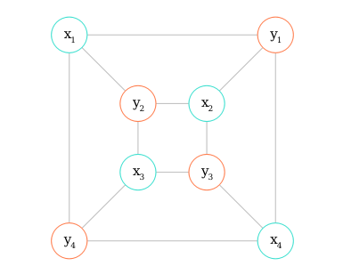

# Checklist {.tabset .tabset-fade .tabset-pills}
## >>

## Checklist 

### Historical perspectives

&#9744; Foundations of Ecology

&#9744; On the Origin of Species

&#9745; Modeling Nature

&#9744; Classic papers

&#9744; Summaries of notable ecologists

### Current Topics

&#9744; Catch up on all journal articles in reading archive

### Ornithology

&#9744; Gill's Ornithology

&#9744; Birds and Habitat

&#9744; Summaries of notable ornithologists

### Conservation Biology

&#9744; Carrol and Fox Conservation Biology

&#9744; Primack cons bio

&#9744; Restoring North America's Birds

&#9744; Saving the World's Deciduous Forests

&#9744; Analysis and Management of Animal Populations

&#9744; Structured Decision Making

### Ecology and Evolution

&#9744; Evolution Textbook

&#9744; Ricklefs and Relyea

&#9744; Gotelli's Primer of Ecology

&#9745; Vandermeer and Goldberg

&#9744; Mittelbach

&#9744; Metapopulation ecology (TBD)

&#9744; Insect and Bird Interactions

&#9744; Ecological Niches: Linking Classical and Contemporary Approaches

&#9744; An Illustrated Guide to Theoretical Ecology

&#9744; The Unified Neutral Theory of Biodiversity and Biogeography

&#9744; Jim Brown's Macroecology

&#9744; History of the Ecosystem Concept

&#9744; Turner and Gardner

&#9744; Scales and levels

### Area sensitivity

&#9744; Key papers

&#9744; Foundational papers

### Modeling, statistics, and math

&#9744; Kery and Royle

&#9744; Hierarchical Modeling and Inference in Ecology

&#9744; The Ecological Detective

&#9744; McCarthy

&#9744; Hobbs and Hooten

&#9744; Burnham and Anderson

&#9745; Matrix Algebra Useful for Statistics (Searle)

&#9744; Hamilton

&#9744; Harville

&#9744; Chung

&#9744; Bayes Theorem

&#9744; Shipley

&#9744; Grace

&#9744; Quinn and Keough

&#9744; Gotelli and Ellison

&#9744; Handbook of Meta-analysis in Ecology and Evolution

&#9744; Occupany Modeling (MacKenzie)

# Historical perspectives {.tabset .tabset-fade .tabset-pills}
## >> 
This section contains notes on classic works in ecology and evolutionary biology or historical perspectives on the development of theories and models in ecology. 

## Foundations of Ecology 

## On the Origin of Species

## Modeling Nature

## Classic papers

#### [@Gould1979]

This paper argues that adaptationists, those who view all traits as having an adaptive purpose or function, are akin to Dr. Pangloss. Adaptationists look at traits and then try to determine why they must be optimized and be part of the best of all possible worlds. If a trait is not optimized, it is assumed to be because of tradeoffs with other traits. 

One of the biggest issues with the adaptationist agenda is that current adaptations mask evolutionary history of trait development. This leads to poor reasoning, like assuming that birds evolved wings to fly. Another example is the shortened front legs of T-rex; if we assume they are adaptive in their current state, this ignores the possibility that they were adaptive to an ancestor of T-rex and are no longer adaptive. 

The adaptationist program also breaks from the <i>Bauplan</i>, which views organisms as whole integrated parts, by atomizing traits and assuming selection can work on individual aspects of an organism.

Evidently there was misappropriation of select quotes in support of creationism.

## Notable ecologists {.tabset .tabset-fade .tabset-pills}

#### Robert MacArthur
#### EO Wilson
#### Charles Darwin
#### Dan Janzen
#### David Tilman
#### Alfred Wallace
#### Ernst Mayr
#### N Tinbergen
#### Stephen J Gould
#### Holling
#### Simberloff
#### Sewall Wright
#### RA Fischer
#### Richard Dawkins
#### Peter and Rosemary Grant
#### Thomas Hunt Morgan
#### JBS Haldane
#### CH Waddington
#### Niles Eldridge
#### RC Lewontin
#### G. Evelyn Hutchinson

# Current topics in ecology {.tabset .tabset-fade .tabset-pills}

## >>

In this section, I have notes on recent papers relevant to my field or interests from selected journals. Articles are chosen for inclusion in this section based on skimming Table of Contents (TOC) emails and it will be updated continuously. 

In order to keep notes in a usable format, they are stored in R objects that are then written to a master .bib file which is linked to kbibtex. Notes are also reproduced here in more readable paragraph form. 

## Trends in Ecology and Evolution

### [@Corlett2015]

The anthropocene refers to the geologic period during which human impacts have as great or greater of an impact on the planet as natural factors. One of the chief issues with the term, which was proposed by Crutzen and Stoermer in 2000, is that "-cene" implies it is an epoch that ends the Holocene rather than a division within the Holocene. 

There is debate about when the Anthropocene started (or will start) if it is an accepted period. Because not all characteristics of the Anthropocene are synchronous (e.g. extinction, ocean acidification, agriculture, greenhouse gas emisssions, etc...) it is difficult to pinpoint a start. To define a geologic period, the International Commission on Stratigraphy needs a physical marker to signify the start of the Anthropocene. 

Ecologists tend to place the start of the Anthropocene much more recently than geologists, typically somewhere in the late 1900s. Although the term really has no bearing on ecology, it shapes how we approach ecology, processes, and conservation. Within conservation biology, it has been somewhat polarizing in terms of creating both a lack of self-efficacy and longing for the past, and also by placing emphasis on the role of humans in shaping natural systems. In some ways, this is similar to the debate between preservationists and conservationists. 

### [@Fox2013]

Fox argues that Connell's Intermediate Disturbance Hypothesis should be abandoned due to a lack of empirical and theoretical support. He cites reviews that show less than 20% of studies on diversity and disturbance show the predicted result of IDH. 

The three theoretical bases for IDH are: 1) disturbance reduced densities and reduces competition, 2) disturbance prevents equilibrium, and 3) rapid fluctuations in dominant species enable coexistence. 

Fox argues that although disturbance reduces densities, it also reduces how competitive a species needs to be to exclude competitors. Coexistence is generally due to other factors besides densities. Disturbance does not disrupt a stable state, but rather increase mortality rates and increases competition between species with different growth rates. The third basis is Hutchinson's paradox of the plankton and notion of a nonequilibrium coexistence mechanism (changing conditions change relative fitness). 

Theoretical models are usually false because of assumptions, but they are still usefull. Fox argues that IDH is logically false and so its predictions do not come from the theory. 

### [@Sheil2013]

The IDH is not actually based on the three things Fox cites, and is instead based on the competition-colonization tradeoff that Fox discusses as being a better explanation for IDH-type patterns. The original IDH was developed for sessile organisms and was focused on succession and was not intended for mobile organisms. Sheil and Burslem also cite a more recent review paper that found support for the IDH in 46%, not 20%, of papers on disturbance-density relationships. 


## Ecology Letters

### [@Hoekstra2005]

This study combines habitat loss and protection efforts to determine the most vulnerable biomes and ecoregions. They used land cover data and information on protected areas for 13 terrestrial biomes and 810 ecoregions (excluding mangroves and Antarctica because of the land cover data). 

The most protected areas are montane grasslands and temperate coniferous forests, yet these are some of the least converted areas. The conversion risk index is an index of relative risk for biodiversity loss and is highest for temperate grasslands and mediterranean forests or scrub. 

The CRI was also calculated for each ecoregion. Every biome except for tundra and boreal forests was represented by at least one ecoregion classified as a "crisis" region. The crisis ecoregions are home to half of endemic IUCN listed vertebrate species. 

The most threatened ecoregions are grouped geographically. The middle of North America, east coast of South America, the area north of the Mediterranean, the Indian subcontinent, and northern China are the most threatened. Despite common emphasis on protecting the tropical rainforest, this is not one of the more threatened regions. 

## Ecology

## Methods in Ecology and Evolution

### [@Harrison2011]

Meta-analysis allows us to determine the effect of one variable on another across studies, which can uncover trends that aren't apparent from many small studies with varying sample sizes and reported effects. 

Effect sizes are standardized measures of change in one variable based on change in another variable that account for sample sizes so they can be used across studies. Studies with low variance in their findings are given greater weight in determining the mean effect size. Variation in effects between studies can also be explained by other variables. 

Recommended reading: Stewart (2010) and Hillebrand (2008). 

Historically, vote-counting of significant vs non-significant relationships across studies has been used to determine support for a hypothesis. This is not a valid way to determine support because different studies have different sample sizes, which can change significance so true effects are masked. 

The effect size pulled from studies for meta-analysis depends on the type of study. Comparison studies take the mean difference between groups, regression-type studies take the correlation coefficient, and for binary responses the odds ratio is used. In addition to finding a mean effect size, meta-analysis also looks at the heterogeneity of effect size across studies. 

Recommended reading: Borenstein et al. 2009, Cooper et al. 2009, Lipsey and Wilson 2001, Koricheva et al (ND). Hedges and Olkin 1980, Gurevitch et al. 1992, Gurevitch and Hedges 1993. 

When doing a meta-analysis, first do a systematic review, then create a database of study ID, effect size, sample size, and other variables that may alter the effect size. 

Often in meta-analysis the effect size for a study needs to be calculated by the given means, variances, etc... because data is not reported in a way that is easily translated into an effect size. 

Because some variance in effect size is due to fixed effects (other variables we know influence the effect, like age or sex) but some variance between studies is random. This can be addressed by doing a mixed-effects model to test for significance of confounding variables. 

Meta-analysis is subject to publication bias because studies that find significant effects in the expected direction are more likely to be published. Funnel plots and failsafe sample size can be used to try to correct for this. Failsafe sample size is the number of unpublished studies that would need to exist to make our calculated mean effect size insignificant due to sampling error. 

## Global Change Biology

### [@Fordham2017]

Instead of taking a mechanistic approach to SDMs, this paper couples populations and demographic factors with environmental variables to model historical range shifts. 

The goal of the study was to run models at varying degrees of complexity, from correlative models to dispersal models to spatially explicit population models to see if the degree of complexity of the model impacted its predictive ability. 

The simple models assume unlimited dispersal, more complex models include species-specific dispersal limitations, and the most complex models include metapopulation dynamics of extinction and colonization. Dispersal models were similar to MigClim models, but instead of predicting a probability of a dispersal event, they predicted the probability of the number of dispersers. In the niche-population model, they included a carrying capacity for each grid cell that was a function of possible maximum abundance, the percent of land cover, suitable climate, and the minimum abundance (to represent an Allee effect). A second niche-population model did not include the percent of land cover. 

In the basic ENM models, including land use improved prediction, but when land use was included in dispersal or metapopulation models it reduced predictive ability. When more complex models did not have land use included, they were the best at predicting ranges. One reason why including land use in the more complex models did a bad job of predicting actual range dynamics is because land use was a static variable and was unknown for grid cells at the start of the model so projections may have had repercussions for later simulations when land use was known. 


### [@Ruxton2010]

In general, a two-tailed test is used if the direction of the effect is unknown or does not matter. A one-tailed test is used if the direction of the effect matters only in one direction and if an opposite direction is equivalent to the null. The main advantage of a one-tailed test is additional power to reject the null, but you ignore the possibility of unexpected results in the other direction. 

Ruxton and Neuhauser propose that if a one-tailed test is used, authors need to explain why the effect could only be in one direction or why that is the only direction of interest, and also they need to justify why a large, negative response is no different from the null. 

Choosing between a one-tailed and two-tailed test needs to be done before exploring the data, otherwise, there is inflation of the type I error rate. 

### [@Manning2010]

Geographic locations can be used as an alternative to capture-recapture methods, but one main issue is that it isn't clear whether individuals sighted at geographic locations can't be identified, unlike a tag. Geographic locations assume that animals use home ranges or nest sites so there is no overlap within a location of individuals sighted. 

This paper proposes a point-coordinate capture-recapture (PCCR) approach to determining population abundance. The approach uses maximum distance moved (MDM) as prior information to estimate space use. Activity centers are estimated based on observations and the activity center and home range are assumed to be constant. 

The method accurately predicts population size based on encounters, rather than trapping. Mean distance between movements should not be used as an estimate of home range because activity centers generally are not the geographic center of a range. 

Individuals should not be modeled with way if MDM overlaps with home range size, as neighbors could be encountered. 


### [@Zuur2010]


## Conservation Biology

## Conservation Letters

### [@Kearney2010]

One of the primary problems with correlative models is that they implicitly include ecological processes, but only link species distributions to environmental variables. Mechanistic SDMs, in contrast, explicitly include ecological processes by linking physiological processes to limiting environmental factors. 

This study uses both a mechanistic, functional trait based model and correlative models to project the range of an Australian possum under climate change. 

The mechanistic model included properties of the fur, mass, shape, and core body temperature of possums in connection to metabolic processes as well as nesting, food, digestion, and efficiency of converting food to milk. 

The mechanistic model overpredicted the species range, though the authors say this is to be expected, whereas the correlative model underpredicted the suitable range. A combined approach does a better job than either individual approach because it incorporates changing environmental conditions and physiological processes. 


## Ecology and Evolution

## Condor

## Auk

## Nature

## Science

## Biometrics

###[@Lin2017a]

Studies that find significant results are more likely to be published; this publication bias can undermine meta-analyses based on systematic review. 

Selection models try to correct for this by modeling the process of papers being removed during publication, but these models are usually too complex to actually work in many cases because of the assumptions made. 

Funnel plots are commonly used as a visual check; if they are skewed to positive effect sizes when there is higher standard error rates, this suggests publication bias. Begg's rank test and Egger's regression test both look at the relationship between effect sizes and sampling variance; a positive relationship is taken as a sign of publication bias. 

The authors propose using skewness as a measure of publication bias and applied it to three studies in order to be able to compare publication bias across meta-analyses. 

###[@Geller2017]

Because assymetry in funnel plots can arise from the scale used for the y-axis, this should be considered in addition to any measure based on funnel plots. 


###[@Jackson2017]

Lin and Chu do not specify how the between-study variance, $\tau^2$ should be used in their approach, though it seems they are suggesting method of moments. One problem with this is that other papers have shown that $\tau^2$ can be affected by publication bias as well. Jackson suggests that the approach needs more development and needs to be tested on more simulated data for both fixed-effects and random-effects models and on actual data. 

## Code for bibliography

```{r, eval=FALSE}

write2bib <- function(article.id="", author="", title="", journal="", volume="", number="", pages="", year="", localfile="", note=""){
    entry <- paste("@article\\{", article.id, ",",
               "author =", "\"", author, "\",",
               "journal = ", "\"", journal, "\"", ",", 
               "localfile = ", "\"", localfile, "\"", ",",
               "note = ", "\"", note, "\"", ",", 
               "number = ", "\"", number, "\"", ",", 
               "pages = ", "\"", pages, "\"", ",", 
               "title = ", "\"", "\\{", title, "\\}", "\"", ",", 
               "volume = ", "\"", volume, "\"", ",", 
               "year = ", "\"", year, "\"",  
               "\\}", sep="")
    edited.entry <- gsub("\\", entry, replacement="", fixed=TRUE)
    read.bib <- readLines("~/master-bib.bib")
    updated.bib <- append(read.bib, entry)
    writeLines(updated.bib, "~/master-bib.bib")
}

#### Corlett2015 ####
id <- "Corlett2015"
auth <- "Richard T Corlett"
title <- "The Anthropocene concept in ecology and conservation"
jour <- "Trends in Ecology and Evolution"
volume <- "30"
num <-"1"
pgs <- "36--41"
yr <- "2015"
file <- "/home/aleph/Documents/readings/TREE/Corlett2015.pdf"
notes <- c("

The anthropocene refers to the geologic period during which human impacts have as great or greater of an impact on the planet as natural factors. One of the chief issues with the term, which was proposed by Crutzen and Stoermer in 2000, is that -cene implies it is an epoch that ends the Holocene rather than a division within the Holocene. 

There is debate about when the Anthropocene started (or will start) if it is an accepted period. Because not all characteristics of the Anthropocene are synchronous (e.g. extinction, ocean acidification, agriculture, greenhouse gas emisssions, etc...) it is difficult to pinpoint a start. To define a geologic period, the International Commission on Stratigraphy needs a physical marker to signify the start of the Anthropocene. 

Ecologists tend to place the start of the Anthropocene much more recently than geologists, typically somewhere in the late 1900s. Although the term really has no bearing on ecology, it shapes how we approach ecology, processes, and conservation. Within conservation biology, it has been somewhat polarizing in terms of creating both a lack of self-efficacy and longing for the past, and also by placing emphasis on the role of humans in shaping natural systems. In some ways, this is similar to the debate between preservationists and conservationists. ")

write2bib(id, auth, title, jour, volume, num, pgs, yr, file, notes)

#### Fox2013 ####

id <- "Fox2013"
auth <- "Jeremy W Fox"
title <- "The intermediate disturbance hypothesis should be abandoned"
jour <- "Trends in Ecology and Evolution"
volume <- "28"
num <- "2"
pgs <- "86--92"
yr <- "2013"
file <- "/home/aleph/Documents/readings/TREE/Fox2013.pdf"
notes <- c("
Fox argues that Connell's Intermediate Disturbance Hypothesis should be abandoned due to a lack of empirical and theoretical support. He cites reviews that show less than 20% of studies on diversity and disturbance show the predicted result of IDH. 

The three theoretical bases for IDH are: 1) disturbance reduced densities and reduces competition, 2) disturbance prevents equilibrium, and 3) rapid fluctuations in dominant species enable coexistence. 

Fox argues that although disturbance reduces densities, it also reduces how competitive a species needs to be to exclude competitors. Coexistence is generally due to other factors besides densities. Disturbance does not disrupt a stable state, but rather increase mortality rates and increases competition between species with different growth rates. The third basis is Hutchinson's paradox of the plankton and notion of a nonequilibrium coexistence mechanism (changing conditions change relative fitness). 

Theoretical models are usually false because of assumptions, but they are still usefull. Fox argues that IDH is logically false and so its predictions do not come from the theory. 
           ")

write2bib(id, auth, title, jour, volume, num, pgs, yr, file, notes)


#### Sheil2013 ####

id <- "Sheil2013"
auth <- "Douglas Sheil and David FRP Burslem"
title <- "Defining and defending Connell's intermediate disturbance hypothesis: a response to Fox"
jour <- "Trends in Ecology and Evolution"
volume <- "28"
num <- "1"
pgs <- "571--572"
yr <- "2013"
file <- "/home/aleph/Documents/readings/TREE/"
notes <- c("
The IDH is not actually based on the three things Fox cites, and is instead based on the competition-colonization tradeoff that Fox discusses as being a better explanation for IDH-type patterns. The original IDH was developed for sessile organisms and was focused on succession and was not intended for mobile organisms. Sheil and Burslem also cite a more recent review paper that found support for the IDH in 46%, not 20%, of papers on disturbance-density relationships. 
           ")

write2bib(id, auth, title, jour, volume, num, pgs, yr, file, notes)

#### Kearney2010 ####

id <- "Kearney2010"
auth <- "Michael R Kearney and Brendan A Wintle and Warren P Porter"
title <- "Correlative and mechanistic models of species distribution provide congruent forecasts under climate change"
jour <- "Conservation Letters"
volume <- "3"
num <- ""
pgs <- "203--213"
yr <- "2010"
file <- "/home/aleph/Documents/readings/cons-letters/Kearney2010.pdf"
notes <- c("

One of the primary problems with correlative models is that they implicitly include ecological processes, but only link species distributions to environmental variables. Mechanistic SDMs, in contrast, explicitly include ecological processes by linking physiological processes to limiting environmental factors. 

This study uses both a mechanistic, functional trait based model and correlative models to project the range of an Australian possum under climate change. 

The mechanistic model included properties of the fur, mass, shape, and core body temperature of possums in connection to metabolic processes as well as nesting, food, digestion, and efficiency of converting food to milk. 

The mechanistic model overpredicted the species range, though the authors say this is to be expected, whereas the correlative model underpredicted the suitable range. A combined approach does a better job than either individual approach because it incorporates changing environmental conditions and physiological processes. 
           ")

write2bib(id, auth, title, jour, volume, num, pgs, yr, file, notes)

#### Fordham2017 ####

id <- "Fordham2017"
auth <- "Damien A Fordham and Cleo Bertelsmeier and Barry W Brook and Regan Early and Dora Neto and Stuart C Brown and Sebastien Ollier and Miguel B Araujo"
title <- "How complex should models be? Comparing correlative and mechanistic range dynamics models"
jour <- "Global Change Biology"
volume <- ""
num <- ""
pgs <- "1--14"
yr <- "2017"
file <- "/home/aleph/Documents/readings/glob-change-bio/Fordham2017.pdf"
notes <- c("

Instead of taking a mechanistic approach to SDMs, this paper couples populations and demographic factors with environmental variables to model historical range shifts. 

The goal of the study was to run models at varying degrees of complexity, from correlative models to dispersal models to spatially explicit population models to see if the degree of complexity of the model impacted its predictive ability. 

The simple models assume unlimited dispersal, more complex models include species-specific dispersal limitations, and the most complex models include metapopulation dynamics of extinction and colonization. Dispersal models were similar to MigClim models, but instead of predicting a probability of a dispersal event, they predicted the probability of the number of dispersers. In the niche-population model, they included a carrying capacity for each grid cell that was a function of possible maximum abundance, the percent of land cover, suitable climate, and the minimum abundance (to represent an Allee effect). A second niche-population model did not include the percent of land cover. 

In the basic ENM models, including land use improved prediction, but when land use was included in dispersal or metapopulation models it reduced predictive ability. When more complex models did not have land use included, they were the best at predicting ranges. One reason why including land use in the more complex models did a bad job of predicting actual range dynamics is because land use was a static variable and was unknown for grid cells at the start of the model so projections may have had repercussions for later simulations when land use was known. 

           ")

write2bib(id, auth, title, jour, volume, num, pgs, yr, file, notes)

#### Harrison2011 ####

id <- "Harrison2011"
auth <- "Freya Harrison"
title <- "Getting started with meta-analysis"
jour <- "Methods in Ecology and Evolution"
volume <- "2"
num <- ""
pgs <- "1--10"
yr <- "2011"
file <- "/home/aleph/Documents/readings/methods/Harrison2011.pdf"
notes <- c("
Meta-analysis allows us to determine the effect of one variable on another across studies, which can uncover trends that aren't apparent from many small studies with varying sample sizes and reported effects. 

Effect sizes are standardized measures of change in one variable based on change in another variable that account for sample sizes so they can be used across studies. Studies with low variance in their findings are given greater weight in determining the mean effect size. Variation in effects between studies can also be explained by other variables. 

Recommended reading: Stewart (2010) and Hillebrand (2008). 

Historically, vote-counting of significant vs non-significant relationships across studies has been used to determine support for a hypothesis. This is not a valid way to determine support because different studies have different sample sizes, which can change significance so true effects are masked. 

The effect size pulled from studies for meta-analysis depends on the type of study. Comparison studies take the mean difference between groups, regression-type studies take the correlation coefficient, and for binary responses the odds ratio is used. In addition to finding a mean effect size, meta-analysis also looks at the heterogeneity of effect size across studies. 

Recommended reading: Borenstein et al. 2009, Cooper et al. 2009, Lipsey and Wilson 2001, Koricheva et al (ND). Hedges and Olkin 1980, Gurevitch et al. 1992, Gurevitch and Hedges 1993. 

When doing a meta-analysis, first do a systematic review, then create a database of study ID, effect size, sample size, and other variables that may alter the effect size. 

Often in meta-analysis the effect size for a study needs to be calculated by the given means, variances, etc... because data is not reported in a way that is easily translated into an effect size. 

Because some variance in effect size is due to fixed effects (other variables we know influence the effect, like age or sex) but some variance between studies is random. This can be addressed by doing a mixed-effects model to test for significance of confounding variables. 

Meta-analysis is subject to publication bias because studies that find significant effects in the expected direction are more likely to be published. Funnel plots and failsafe sample size can be used to try to correct for this. Failsafe sample size is the number of unpublished studies that would need to exist to make our calculated mean effect size insignificant due to sampling error. 
           ")

write2bib(id, auth, title, jour, volume, num, pgs, yr, file, notes)

#### Lin2017-1 ####

id <- "Lin2017a"
auth <- "Lifeng Lin and Haitao Chu"
title <- "Quantifying publication bias in meta-analysis"
jour <- "Biometrics"
volume <- ""
num <- ""
pgs <- ""
yr <- "2017"
file <- "/home/aleph/Documents/readings/biometrics/Lin2017-1.pdf"
notes <- c("
Studies that find significant results are more likely to be published; this publication bias can undermine meta-analyses based on systematic review. 

Selection models try to correct for this by modeling the process of papers being removed during publication, but these models are usually too complex to actually work in many cases because of the assumptions made. 

Funnel plots are commonly used as a visual check; if they are skewed to positive effect sizes when there is higher standard error rates, this suggests publication bias. Begg's rank test and Egger's regression test both look at the relationship between effect sizes and sampling variance; a positive relationship is taken as a sign of publication bias. 

The authors propose using skewness as a measure of publication bias and applied it to three studies in order to be able to compare publication bias across meta-analyses. 
           ")

write2bib(id, auth, title, jour, volume, num, pgs, yr, file, notes)

#### Geller2017 ####

id <- "Geller2017"
auth <- "Nancy L Geller"
title <- "Discussion on 'Quantifying Publication Bias in Meta-Analysis' by Lin and Chu"
jour <- "Biometrics"
volume <- ""
num <- ""
pgs <- ""
yr <- "2017"
file <- "/home/aleph/Documents/readings/biometrics/Geller2017.pdf"
notes <- c("
Because assymetry in funnel plots can arise from the scale used for the y-axis, this should be considered in addition to any measure based on funnel plots. 
           ")

write2bib(id, auth, title, jour, volume, num, pgs, yr, file, notes)

#### Jackson2017 ####

id <- "Jackson2017"
auth <- "Dan Jackson"
title <- "Discussion on quantifying publication bias in meta-analysis"
jour <- "Biometrics"
volume <- ""
num <- ""
pgs <- ""
yr <- "2017"
file <- "/home/aleph/Documents/readings/biometrics/Jackson2017.pdf"
notes <- c("
Lin and Chu do not specify how the between-study variance, $\tau^2$ should be used in their approach, though it seems they are suggesting method of moments. One problem with this is that other papers have shown that $\tau^2$ can be affected by publication bias as well. Jackson suggests that the approach needs more development and needs to be tested on more simulated data for both fixed-effects and random-effects models and on actual data. 

           ")

write2bib(id, auth, title, jour, volume, num, pgs, yr, file, notes)

#### Hoekstra2005 ####

id <- "Hoekstra2005"
auth <- "Jonathan M Hoekstra and Timothy M Boucher and Taylor H Ricketts and Carter Roberts"
title <- "Confronting a biome crisis: global disparities of habitat loss and protection"
jour <- "Ecology Letters"
volume <- "8"
num <- ""
pgs <- "23--29"
yr <- "2005"
file <- "/home/aleph/Documents/readings/eco-letters/Hoekstra2005.pdf"
notes <- c("

This study combines habitat loss and protection efforts to determine the most vulnerable biomes and ecoregions. They used land cover data and information on protected areas for 13 terrestrial biomes and 810 ecoregions (excluding mangroves and Antarctica because of the land cover data). 

The most protected areas are montane grasslands and temperate coniferous forests, yet these are some of the least converted areas. The conversion risk index is an index of relative risk for biodiversity loss and is highest for temperate grasslands and mediterranean forests or scrub. 

The CRI was also calculated for each ecoregion. Every biome except for tundra and boreal forests was represented by at least one ecoregion classified as a 'crisis' region. The crisis ecoregions are home to half of endemic IUCN listed vertebrate species. 

The most threatened ecoregions are grouped geographically. The middle of North America, east coast of South America, the area north of the Mediterranean, the Indian subcontinent, and northern China are the most threatened. Despite common emphasis on protecting the tropical rainforest, this is not one of the more threatened regions. 
           ")

write2bib(id, auth, title, jour, volume, num, pgs, yr, file, notes)

#### Ruxton2010 ####

id <- "Ruxton2010"
auth <- "Graeme D Ruxton and Markus Neuhauser"
title <- "When should we use one-tailed hypothesis testing?"
jour <- "Methods in Ecology and Evolution"
volume <- "1"
num <- ""
pgs <- "114--117"
yr <- "2010"
file <- "/home/aleph/Documents/readings/methods/Ruxton2010.pdf"
notes <- c("

In general, a two-tailed test is used if the direction of the effect is unknown or does not matter. A one-tailed test is used if the direction of the effect matters only in one direction and if an opposite direction is equivalent to the null. The main advantage of a one-tailed test is additional power to reject the null, but you ignore the possibility of unexpected results in the other direction. 

Ruxton and Neuhauser propose that if a one-tailed test is used, authors need to explain why the effect could only be in one direction or why that is the only direction of interest, and also they need to justify why a large, negative response is no different from the null. 

Choosing between a one-tailed and two-tailed test needs to be done before exploring the data, otherwise, there is inflation of the type I error rate. 

           ")

write2bib(id, auth, title, jour, volume, num, pgs, yr, file, notes)

#### Manning2010 ####

id <- "Manning2010"
auth <- "Jeffrey A Manning and Caren S Goldberg"
title <- "Estimating population size using capture-recapture encounter histories created from point-coordinate locations of animals"
jour <- "Methods in Ecology and Evolution"
volume <- "1"
num <- ""
pgs <- "389--397"
yr <- "2010"
file <- "/home/aleph/Documents/readings/methods/Manning2010.pdf"
notes <- c("

Geographic locations can be used as an alternative to capture-recapture methods, but one main issue is that it isn't clear whether individuals sighted at geographic locations can't be identified, unlike a tag. Geographic locations assume that animals use home ranges or nest sites so there is no overlap within a location of individuals sighted. 

This paper proposes a point-coordinate capture-recapture (PCCR) approach to determining population abundance. The approach uses maximum distance moved (MDM) as prior information to estimate space use. Activity centers are estimated based on observations and the activity center and home range are assumed to be constant. 

The method accurately predicts population size based on encounters, rather than trapping. Mean distance between movements should not be used as an estimate of home range because activity centers generally are not the geographic center of a range. 

Individuals should not be modeled with way if MDM overlaps with home range size, as neighbors could be encountered. 
           ")

write2bib(id, auth, title, jour, volume, num, pgs, yr, file, notes)


#### Zuur2010 ####

id <- "Zuur2010"
auth <- "Alain F Zuur and Elena N Ieno and Chris S Elphick"
title <- "A protocol for data exploration to avoid common statistical problems"
jour <- "Methods in Ecology and Evolution"
volume <- "1"
num <- ""
pgs <- "3--14"
yr <- "2010"
file <- "/home/aleph/Documents/readings/methods/Zuur2010.pdf"
notes <- c("


           ")

write2bib(id, auth, title, jour, volume, num, pgs, yr, file, notes)


#### NEXT PAPER ####

id <- ""
auth <- ""
title <- ""
jour <- ""
volume <- ""
num <- ""
pgs <- ""
yr <- ""
file <- "/home/aleph/Documents/readings/methods/"
notes <- c("


           ")

write2bib(id, auth, title, jour, volume, num, pgs, yr, file, notes)

#### NEXT PAPER ####

id <- ""
auth <- ""
title <- ""
jour <- ""
volume <- ""
num <- ""
pgs <- ""
yr <- ""
file <- "/home/aleph/Documents/readings/methods/"
notes <- c("


           ")

write2bib(id, auth, title, jour, volume, num, pgs, yr, file, notes)


#### NEXT PAPER ####

id <- ""
auth <- ""
title <- ""
jour <- ""
volume <- ""
num <- ""
pgs <- ""
yr <- ""
file <- "/home/aleph/Documents/readings/methods/"
notes <- c("


           ")

write2bib(id, auth, title, jour, volume, num, pgs, yr, file, notes)


#### NEXT PAPER ####

id <- ""
auth <- ""
title <- ""
jour <- ""
volume <- ""
num <- ""
pgs <- ""
yr <- ""
file <- "/home/aleph/Documents/readings/methods/"
notes <- c("


           ")

write2bib(id, auth, title, jour, volume, num, pgs, yr, file, notes)


#### NEXT PAPER ####

id <- ""
auth <- ""
title <- ""
jour <- ""
volume <- ""
num <- ""
pgs <- ""
yr <- ""
file <- "/home/aleph/Documents/readings/methods/"
notes <- c("


           ")

write2bib(id, auth, title, jour, volume, num, pgs, yr, file, notes)


#### NEXT PAPER ####

id <- ""
auth <- ""
title <- ""
jour <- ""
volume <- ""
num <- ""
pgs <- ""
yr <- ""
file <- "/home/aleph/Documents/readings/methods/"
notes <- c("


           ")

write2bib(id, auth, title, jour, volume, num, pgs, yr, file, notes)


#### NEXT PAPER ####

id <- ""
auth <- ""
title <- ""
jour <- ""
volume <- ""
num <- ""
pgs <- ""
yr <- ""
file <- "/home/aleph/Documents/readings/methods/"
notes <- c("


           ")

write2bib(id, auth, title, jour, volume, num, pgs, yr, file, notes)


#### NEXT PAPER ####

id <- ""
auth <- ""
title <- ""
jour <- ""
volume <- ""
num <- ""
pgs <- ""
yr <- ""
file <- "/home/aleph/Documents/readings/methods/"
notes <- c("


           ")

write2bib(id, auth, title, jour, volume, num, pgs, yr, file, notes)


#### NEXT PAPER ####

id <- ""
auth <- ""
title <- ""
jour <- ""
volume <- ""
num <- ""
pgs <- ""
yr <- ""
file <- "/home/aleph/Documents/readings/methods/"
notes <- c("


           ")

write2bib(id, auth, title, jour, volume, num, pgs, yr, file, notes)


#### NEXT PAPER ####

id <- ""
auth <- ""
title <- ""
jour <- ""
volume <- ""
num <- ""
pgs <- ""
yr <- ""
file <- "/home/aleph/Documents/readings/methods/"
notes <- c("


           ")

write2bib(id, auth, title, jour, volume, num, pgs, yr, file, notes)


#### NEXT PAPER ####

id <- ""
auth <- ""
title <- ""
jour <- ""
volume <- ""
num <- ""
pgs <- ""
yr <- ""
file <- "/home/aleph/Documents/readings/methods/"
notes <- c("


           ")

write2bib(id, auth, title, jour, volume, num, pgs, yr, file, notes)


#### NEXT PAPER ####

id <- ""
auth <- ""
title <- ""
jour <- ""
volume <- ""
num <- ""
pgs <- ""
yr <- ""
file <- "/home/aleph/Documents/readings/methods/"
notes <- c("


           ")

write2bib(id, auth, title, jour, volume, num, pgs, yr, file, notes)


#### NEXT PAPER ####

id <- ""
auth <- ""
title <- ""
jour <- ""
volume <- ""
num <- ""
pgs <- ""
yr <- ""
file <- "/home/aleph/Documents/readings/methods/"
notes <- c("


           ")

write2bib(id, auth, title, jour, volume, num, pgs, yr, file, notes)


#### NEXT PAPER ####

id <- ""
auth <- ""
title <- ""
jour <- ""
volume <- ""
num <- ""
pgs <- ""
yr <- ""
file <- "/home/aleph/Documents/readings/methods/"
notes <- c("


           ")

write2bib(id, auth, title, jour, volume, num, pgs, yr, file, notes)


#### NEXT PAPER ####

id <- ""
auth <- ""
title <- ""
jour <- ""
volume <- ""
num <- ""
pgs <- ""
yr <- ""
file <- "/home/aleph/Documents/readings/methods/"
notes <- c("


           ")

write2bib(id, auth, title, jour, volume, num, pgs, yr, file, notes)


#### NEXT PAPER ####

id <- ""
auth <- ""
title <- ""
jour <- ""
volume <- ""
num <- ""
pgs <- ""
yr <- ""
file <- "/home/aleph/Documents/readings/methods/"
notes <- c("


           ")

write2bib(id, auth, title, jour, volume, num, pgs, yr, file, notes)


#### NEXT PAPER ####

id <- ""
auth <- ""
title <- ""
jour <- ""
volume <- ""
num <- ""
pgs <- ""
yr <- ""
file <- "/home/aleph/Documents/readings/methods/"
notes <- c("


           ")

write2bib(id, auth, title, jour, volume, num, pgs, yr, file, notes)


#### NEXT PAPER ####

id <- ""
auth <- ""
title <- ""
jour <- ""
volume <- ""
num <- ""
pgs <- ""
yr <- ""
file <- "/home/aleph/Documents/readings/methods/"
notes <- c("


           ")

write2bib(id, auth, title, jour, volume, num, pgs, yr, file, notes)


#### NEXT PAPER ####

id <- ""
auth <- ""
title <- ""
jour <- ""
volume <- ""
num <- ""
pgs <- ""
yr <- ""
file <- "/home/aleph/Documents/readings/methods/"
notes <- c("


           ")

write2bib(id, auth, title, jour, volume, num, pgs, yr, file, notes)


#### NEXT PAPER ####

id <- ""
auth <- ""
title <- ""
jour <- ""
volume <- ""
num <- ""
pgs <- ""
yr <- ""
file <- "/home/aleph/Documents/readings/methods/"
notes <- c("


           ")

write2bib(id, auth, title, jour, volume, num, pgs, yr, file, notes)


#### NEXT PAPER ####

id <- ""
auth <- ""
title <- ""
jour <- ""
volume <- ""
num <- ""
pgs <- ""
yr <- ""
file <- "/home/aleph/Documents/readings/methods/"
notes <- c("


           ")

write2bib(id, auth, title, jour, volume, num, pgs, yr, file, notes)


#### NEXT PAPER ####

id <- ""
auth <- ""
title <- ""
jour <- ""
volume <- ""
num <- ""
pgs <- ""
yr <- ""
file <- "/home/aleph/Documents/readings/methods/"
notes <- c("


           ")

write2bib(id, auth, title, jour, volume, num, pgs, yr, file, notes)


```


# Ornithology {.tabset .tabset-fade .tabset-pills}
## >>

Because I am studying birds, this section is dedicated to the field of ornithology and more specifically, my study system and trophic interactions. 

## Gill's Ornithology
## Birds and Habitat
## Ovenbirds
## Notable ornithologists {.tabset .tabset-fade .tabset-pills}
### David Lack
### Margaret Morse-Nice
### John James Audubon
### Louis Agassiz Fuertes
### Alexander Wilson
### John Gould
### Thomas Nuttall
### John Kirk Townsend
### Roger Tory Peterson
### David Sibley

# Conservation biology {.tabset .tabset-fade .tabset-pills}

## >>

Although I don't model conservation biology explicitly, contributing to knowledge about species' conservation is an implicit goal in all of my research. 

## Carroll and Fox

## Primack

## Restoring North American Birds

## Saving the World's Deciduous Forests

## Analysis and Management of Animal Populations

## Structured decision making 

Jim Nichols, Bryan Ken Williams, Andy J Royle
Sustainable resource management

# Basic evolution {.tabset .tabset-fade .tabset-pills}

## >>

I have not taken a graduate course in evolution yet and will not take it until after my general exams, so this section will be necessarily somewhat brief and will only cover basic topics in evolution. 

# General ecology {.tabset .tabset-fade .tabset-pills}

## >>

Although there are more specific sections below for population and community ecology and landscape ecology, this section is dedicated to general ecology and is based on introductory ecology texts. 

## Ricklefs and Relyea

### Chapter 1: Ecology, Evolution, and the Scientific Method

This chapter deals primarily with basic conepts in ecology, such as populations and ecosystems, so the notes are quite brief in an attempt to use time effectively. 

Ernst Haeckel gave the first formal definition of ecology and species interactions, describing what Darwin called the "economy of nature."

Ecological systems must obey the law of the conservation of mass and the conservation of energy (first law of thermodynamics). If a system has gains and losses balancing each other, it is a dynamic steady state. 

### Chapter 2: Adapatations to Aquatic Environments

$Q_{10}$ is a ratio of physiological activity at some temperature to activity at ten degrees cooler; it measures sensitivity of physiological processes to temperature.

### Chapter 3: Adaptations to Terrestrial Environments

Water potential is measured in megapascals; at 0 MPa, water is saturated; at around -1.5 MPa is the wilting point. Water potential is based on osmotic pressure. 

### Chapter 4: Adaptations to Variable Environments

Phenotypic plasticity in behavior, morphology; foraging behavior and central place foraging theory. 

### Chapter 5: Climates and Soils

Young soils have low cation exchange capacity because they have less clay and less organic matter so they don't have calcium, magnesium, potassium, or sodium in great abundance. In acidic soils, podsolization are leached from the B to E horion. Lateritic soils are not acidic, but have ben extremely weathered so clay has leached down to the E layer leaving mostly oxides. Lateritic soils are common in the tropics, whereas podsolized soils are common in New England and the Great Lakes region. 

### Chapter 6: Terrestrial and Aquatic Biomes

Biomes are mostly defined by precipitation and climate. 

Rivers can have allochtonous (similar to exogenous) inputs from outside materals, or internally produced, autochthonous (similar to endogenous) inputs of organic matter. 


### Chapter 7: Evolution and Adaptation

Polygenic traits are caused by affects of multiple genes. Pleiotropy is when one gene affects several traits. Epistasis is when one gene's expression is regulated by a different gene. 

### Chapter 8: Life Histories

Life history traits are all tied to fitness. Because of life history tradeoffs, we can generally group organisms along a continuum from slow to fast reproductive strategies. 

### Chapter 9: Reproductive Strategies

Local mate competition favors female offspring (fig wasp). 

### Chapter 10: Social Behaviors

Eusociality and haplodiploidy, types of social interactions. 


## Gotelli

# Population and community ecology {.tabset .tabset-fade .tabset-pills}

## >>

## Vandermeer and Goldberg

### 1. Elementary Population Dynamics
$\frac{Kk-N}{K}$ from the logistic equation $\frac{dN}{dt}=rN\frac{(K-N)}{K}$ can be thought of as the available niche space that has not already been used by members of the population. 

Shinozaki and Kira came up with a simple hyperbolic equation to describe yield-density relationships that result in constant final yield. Yield is a function of density, maximum yield without density effects, and a constant. $Y=\frac{D(w_{max})}{(1+\alpha D)}$.If $k$ is the biomass of a single plant growing alone, then the biomass of a plot of plants is $w=k-\sum\alpha_{i,j}w_j$ which can be rearranged to get the average biomass of an individual in the plot as $w' = \frac{k}{(1+\alpha ' D)}$. Yoda reasoned that the $-\frac{3}{2}$ constant of yield decrease with increasing density was due to trees being equated with cubes and with self-thinning this is the expected constant.

### 2. Life History Analysis
Semelparous strategy is to do either reproduction or maintenance in a given year, contrasted with iteroparity in which a bit of energy is put into both. Depending on if it is a good year in terms of resources or a bad year, one or the other strategy can be favored. For an annual plant, fecundity has to be higher than fecundity for a perennial in order for it to be the strategy. 

### 3. Projection Matrices: Structured Models
Structured populations at their stable age distribution grow exponentially, but density dependence can be incorporated into Leslie (population projection) matrices. Lewis actually came up with the matrices in 1942, three years before Leslie. In a Leslie matrix, the first row is the fecundities (generally, $m$) and the diagonal is the survival probabilities at that age class. 

The rate of increase of a stable age population is the dominant eigenvalue of the projection matrix. If we have a sufficiently large $t$, we can say that $N_{t+1}=\lambda N_t$ where $\lambda$ is the diagonal of the matrix resulting from multiplying $P$ by itself $n$ times. We can rewrite this as $PN_t = \lambda N_t$, which when rearranged and factored is $(P-\lambda I)N_t =0$ with $I$ as the identity matrix. The determinant of this is $\lambda^2 - gm$ and the roots of this are the eigenvalues; the larger is the dominant eigenvalue and represents the rate of increase in the population. 

When a population follows $PN_t=\lambda N_t$, then we can say that there is a column vector $u$ that satisfies the equation $Pu = \lambda u$ and a vector $v$ that satisfies $P'v = \lambda v$. $u$ is the right eigenvector and represents the contribution of other stages to that stage (stable stage distribution) and $v$ is the left eigenvector that represents the contributions of a stage to all other stages (reproductive value).

The <b>sensitivity</b> of a matrix is how the rate of population growth changes with changes to $p_{ij}$. Because changes are in the units of the matrix and mortality and natality vary widely (e.g. grasses with thousands of seeds), ecologists use elasticity which is based on logs. Elasticity is $e_{ij}=\frac{\partial(\ln\lambda)}{\partial(\ln p_{ij}}$. This sums to 1, so elasticity of each individual element of the matrix can be seen as proportional sensitivity. 

### 4. A Closer Look at the 'Dynamics' in Population Dynamics
Attractor means a singularity in stable equilibrium, a repellor is a singularity that leads to unstable equilibrium. These can be visualized as a magnet falling through a beaker of water and the trajectory as viewed from the bottom matches with the phase plane diagrams; swirling the bucket creates oscillators which leads to damped oscillations if it is an oscillatory point attractor. There are also periodic attractors/repellers, like a bundt cake pan. Strange attractors are attractors that are flat from a distance, but up close are bumpy, so once a system reaches them, then it bounces around on that bumpy space. With strange attractors, we want to know the range over which a system can move and also its morphology.

The eigenvalue is the rate at which a system tends towards a point attractor and can be thought of as the slope of the line connecting the tips of the arrows pointing towards an attractor. If the eigenvalue has a non-zero complex part (i.e. it has $i$) then it is oscillatory; if the complex part is positive, it is a repellor and if it is negative then it is an attractor. <br><br>

In a one-dimensional graph created by stair-stepping, the slope of the function as it crosses the 45-degree plane is the eigenvalue. <br><b><center>oscillatory repellor $< 1 <$ oscillatory attractor $< 0 <$ point attractor  $< 1 <$ point repellor</center></b>

Systems are structurally unstable if a small change in $r$ leads to a change in the behavior of the system. These are bifurcation points and can lead to period doubling; Hopf bifurcations are a special case for continuous systems with differential equations. Bifurcations create attractors (nodes) and repellors (saddles) and are sometimes called "blue sky bifurcations" because they come out of the blue. Basin coundary collisions are a special type of bifurcation in which a point and strange attractors basins collide. Enough bifurcations lead to chaos via the period doubling route to chaos. 

## Metapopulation Ecology
## Mittelbach
## Insect and Bird Interactions
## Ecological Niches: Linking Classical and Contemporary Approaches

# Macroecology and theoretical ecology {.tabset .tabset-fade .tabset-pills}
## >>
## An Illustrated Guide to Theoretical Ecology
## The Unified Neutral Theory of Biodiversity and Biogeography

## Jim Brown's Macroecology

## History of the Ecosystem Concept

# Landscape ecology {.tabset .tabset-fade .tabset-pills}

## >>

## Turner and Gardner

## Scales and levels

Cash

# Area sensitivity {.tabset .tabset-fade .tabset-pills}

## >>

## Key papers

## Foundational papers

# Ecological modeling {.tabset .tabset-fade .tabset-pills}

## >>

## Kery and Royle

## Hierarchical Modeling and Inference in Ecology

## The Ecological Detective

# Occupancy modeling

# Species Distribution Models {.tabset .tabset-fade .tabset-pills}

## >>

# Bayesian statistics {.tabset .tabset-fade .tabset-pills}

## >>

## McCarthy

## Hobbs and Hooten

# Information theoretic approach {.tabset .tabset-fade .tabset-pills}

## >>


# Linear algebra {.tabset .tabset-fade .tabset-pills}

## >>

## Searle {.tabset .tabset-fade .tabset-pills}

### Introduction

#### The scope of matrix algebra
Matrices are rectangular arrays of numbers in rows and columns. Matrix algebra is the algebra of manipulating matrices. Matrix algebra is critical to statistical computing, especially for large data sets.

#### General description of a matrix
A matrix is an array of numbers and resembles taking out the data from a table but keeping the meaning based on its fixed position. Matrixes are rextangular or square with entries in rows and columns. Entries in a row or column have something in common (e.g. they are measuring the same aspect of an object or are measurements from the same object). 

In matrix algebra, each matrix is treated as an entity denoted by a single symbol, rather than as the complete array. For example, we could take the matrix below and assign it as $A$.
\[ \left[ \begin{array}{ccc}
a & b & c \\
d & e & f \\
g & h & i \end{array} \right]\] 

#### Subscript notation
It is more helpful to write matrix $A$ using subscripts, rather than letters, because there are only 26 letters. 
\[ A = \left[ \begin{array}{ccc}
a_1 & a_2 & a_3 \\
a_4 & a_5 & a_6 \\
a_7 & a_8 & a_9 \end{array} \right]\] 
The same principal can be applied to row and column notation. For example, all elements in a row could begin with the same number and all elements in a column could end with the same number as illustrated below.
\[ A = \left[ \begin{array}{ccc}
a_{11} & a_{12} & a_{13} \\
a_{21} & a_{22} & a_{23} \\
a_{31} & a_{32} & a_{33} \end{array} \right]\] 

We can denote a row as $i$ and a column as $j4. Thus, $a_{ij}$ is equal to the object in the $i$th row and $j$th column. If $i=2$ and $j=3$, then $a_{ij} = a_{33}$. We can then say that the entire matrix $A = {a_{ij}}$ for $i=1,2$ and $j=1,2,3$.

#### Summation notation
The summation of a series can be written as illustrated below.

<center>  $\sum\limits_{i=1}^{n}x_{i} = x_1 + x_2 +x_3 + \ldots + x_{n-2}+x_{n-1}+x_n$  </center>


This can be applied to matrix notations as well. Using the same example as above, we can see that:

<center>
$\sum\limits_{i=1}^{2}a_{ij} = a_{1j} + a_{2j}$  and  $\sum\limits_{j=1}^{3} a_{ij} = a_{i1} + a_{i2} + a_{i3}$
</center> 
This means that the entire matrix can be written in summation notation as 
<center>  $\sum\limits_{i=1}^{2}\sum\limits_{j=1}^{3}a_{ij}$ </center> or, in more general terms as <center> $\sum\limits_{i=1}^{m}\sum\limits_{j=1}^{n}a_{ij}$
</center>
This notation can also be used to indicate summing the term by term products of two matrices, as shown below for $A$ and a new matrix, $B$. 
<center>  $\sum\limits_{j=1}^{m}a_{ij}b_{jk}$
</center>
If instead of summing the term by term products of multiplying two matrices you want to multiply them, you can use $\Pi$ in lieu of $\Sigma$. 

#### Dot notation
If the context of the limits for summation are clear, $\sum\limits_{i=1}^{m}a_{ij}$ can be replaced by $a._j$ or we can say that $a.. = \sum\limits_{i=1}^{m}\sum\limits_{j=1}^{n}a_{ij}$

#### Definition of a matrix
The order of a matrix is the number of its rows and columns (i.e. size). Order is written as $r\times c$ and is often put as a subscript, such as $A_{r\times c}$. 

Transition probability matrices always sum to 1.00 across each row. This is part of a class of probability models called Markov chains. Transition probability matrices can be used to determine the probabilities of moving from category $i$ to $j$ in a given time. 

#### Vectors and scalars
Column vectors consist of a single column and a matrix that is a single row is a row vector. Examples are shown below. <center> 
\[c= \left[ \begin{array}{c}
a \\ b \\ c\end{array} \right]\] 
\[r'= \left[ \begin{array}{ccc}
a & b & c\end{array} \right]\] 
</center>
In general objects within a matrix are scalars, but it is possibly to have a matrix whose elements are other matrices. 

#### General notation
In general, matrices are denoted by capital letters and element are lowercase counterparts. column vectors ($x$) are letters from the end of the alphabet and prime superscripts of the same letter indicate row vectors ($x'$). Scalars are indicated as $\lambda$. 

### Basic Operations

#### The transpose of a matrix
Arrays can be rearranged to switch columns and rows. The transpose of a matrix is denoted $A'$ and transposed elements as $a'_{ij}$. 

The reason row vectors are denoted as $x'$ is because they are the transpose of a column vector. 

#### Partitioned matrices
A matrix can be partitioned into smaller matrices as long as the lines breaking it go the full length of a row or column. The original matrix can then be thought of as a matrix composed of several submatrices.
<center> \[A_{r\times c} = \left[ \begin{array}{cc}
K_{p\times q} & L_{p\times(c-q)}\\
M_{(r-p)\times q} & N_{(r-p)\times (c-q)}\end{array} \right]\]
</center>  

#### The trace of a matrix
The trace of a matrix is the sum of the diagonal elements of a square matrix. If a matrix is not square then the trace is not defined. 

#### Addition
The sum of two matrices is the matrix of sums for every element by element sum. In order to add matrices, they must have the same order, in which case they are conformable for addition. 

#### Scalar multiplication
If a matrix is multipled by $\lambda$, every element is multiplied by $\lambda$.

#### Subtraction
 Subtraction, like addition, is done on an element by element basis and matrices must be conformable for subtraction, meaning they must be of the same order. 

#### Equality and the null matrix
 Every matrix has a null matrix of the same order composed entirely of 0. 

#### Multiplication
The inner product of two vectors $a'$ and $x$ can be found if they have the same order. Each element of $a'$ is multiplied by the corresponding element in $x$ and summed as shown below.<center>  $\sum\limits_{i-1}^{n}{a_i}{x_i}$  </center>

If you instead want to multiply a matrix with two or more rows by a single column vector, the result is a column vector. 
 <center>
 \[Ax = \left[\begin{array}{c}
 a'_{1}\\
 a'_{2}\end{array}\right]x = \left[\begin{array}{c}
 a'_{1}x\\
 a'_{2}x\end{array}\right]\] </center>
An identity matrix is a matrix where all diagonal elements are equal to unity. In other words, if the null matrix is the 0 of matrices, then the identity matrix is 1. 

Powers of a matrix can only be obtained if it is a square matrix. Looking at the powers of a matrix indicates direct and indirect paths to figure out the number of ways something can be done based on things only occuring in one direction or transmission.

#### The laws of algebra
Review of associative, commutative, and distributive laws. 

#### Contrasts with scalar algebra
Need to keep conformability in mind because some values will not be possible. Even if $AB = 0$, this does not mean that $A$ or $B$ is equal to 0, unlike in scalar algebra. If $M = M^2$, it is idempotent.

### Special matrices
#### Symmetric matrices
Any matrix that is its own transpose is symmetric. Products of symmetric matrices are not generally symmetric. This is partly due to symmetric matrices not needing to be square and having a different order than its transpose. Skew-symmetric matrices are symmetric, except instead of being equal to their transpose they are equal to the negative of the elements. 

#### Matrices having all elements equal
Matrices where every element is unity (1) are summing vectors. 

#### Idempotent matrices
Idempotent matrices are when $K^2 = K$. They play an important role in statistics.

#### Orthogonal matrices
Orthogonal matrices have the property $AA' = I = A'A$.

The norm of a vector is equal to the square root of $x'x$, which is equivalent to what is shown below. If the norm of a vector is unity, it is called normal or a unit vector. 
<center>  $\left(\sum\limits_{i=1}^{n}x_{i}^{2}\right)^{\frac{1}{2}}$  </center>
Any non-null vectors can be normalized by multiplying them by the scalar $\frac{1}{\sqrt{x'x}}$. Orthonormal vectors are both orthogonal and normalized. 

#### Quadratic forms
The quadratic form takes the form of $x'Cx$, which is equal to $\sum\limits_{i=1}^{n}(x_{i} - \bar{x})^{2}$. This means multiplying a row vector ($x'$) by a matrix ($C$) by the transpose of the row vector, which is now a column vector ($x$). For statistics, assume that in $x'Ax$, $A = A'$, meaning it is symmetric. 

#### Positive definite matrices
Positive definite, positive semidefinite, and non-negative definite matrices are always symmetric because they are in terms of quadratic forms. 

### Determinants

#### Expansion by minors
Determinants are scalars that are the polynomial of the elements of a square matrix. They are only defined for square matrices. First-order determinants are the value of the only element. Second order determinands are calculated by taking the product of the diagonals and subtracting the product of the off-diagonals. 
\[|A| = \left| \begin{array}{cc} a_{11} & a_{12}\\ a_{21} & a_{22} \end{array} \right| = a_{11}a_{22} - a_{12}a_{21}\]
To find third-order determinants, you take an element and multiply it by the determinant of its minors, which are the elements not contained in its row or column. You don't have to start with row one; any element will result in the same determinant. 
\[|A| = \left| \begin{array}{ccc} 1&2&3\\4&5&6\\7&8&9 \end{array} \right| = 1\left|\begin{array}{cc}5&6\\8&10\end{array}\right| - 2 \left|\begin{array}{cc}4&6\\7&10\end{array}\right| +3\left|\begin{array}{cc}4&5\\7&8\end{array}\right| \]
To determine whether a term should be added or subtracted, use $(-1)^{i+j}$ as the sign. For n-order determinants, use the equation below. $|M_{ij}|$ denotes the minor. 
<center>  $|A| = \sum\limits_{i=1}^{n}a_{ij}(-1)^{i+j}|M_{ij}|$
 </center>

#### Formal definition

#### Basic properties
The determinant of the transpose of a matrix equals the determinant of the matrix itself because expansion by rows is the corollary of expansion by columns. 

If two rows of $A$ are the same, $|A|=0$. 

The signed minor is called a cofactor, as illustrated below. <center>  $c_{ij}=(-1)^{(i+j)}|M_{ij}|$  </center>

The sum of the elements of a row with their own cofactors is the determinant. <center>  $\sum\limits_{j}^{}a_{ij}c_{ij} = \sum\limits_{j}^{}a_{ij}(-1)^{(i+j)}|M_{ij}| = |A|$
 </center>
The sum of products of elements of a row with cofactors of some other row is zero.
Adding to one row (or column) of a matrix any multiple of another row (or column) does not affect the value of the determinant.
When $A$ and $B$ are square and of the same order, $|AB|=|A||B|$. Any determinant can be reduced to the determinant of a triangular matrix by adding multiples of row elements to another row to make it triangular. 

#### Elementary row operations
When $\lambda$ is a factor of a row (or column) of $|A|$, it is also a factor of $|A|$. This means that $|A| = \lambda|A|$ when $\lambda$ is factored out of a row or column. 

When a determinant has zero for every element of a row or column the determinant is zero.

Interchanging two rows or columns of a determinant changes its sign. 

Do not add rows to multiples of a row (but adding multiples of a row to a row is fine). 

#### Diagonal expansion
Any matrix can be written as the sum of two matrices where one of them is a diagonal matrix. The determinant of a matrix written this way is a polynomial of the elements of the diagonal matrix. 

#### Laplace expansion

#### Sums and differences of determinants
The sum or difference of the determinants of two or more matrices does not equal the determinant of the sum or difference of two matrices. $|A|-|B| \neq |A-B|$. Even if matrices are of different orders, their determinants can still be compared because determinants are scalars. 

### Inverse matrices
Division does not exist with matrices. Instead, "dividing" a matrix by $A$ is done by multiplying a matrix by the inverse of $A$.

#### Solving equations
 The inverse of a square matrix $A$ is a matrix $A^{-1}$ that when multiplied with $A$ results in the identity matrix. Any set of linear equations with a unique solution can be solved as $x=A^{-1}b$ if put in the form $Ax=b$.

#### Products equal to I
Although being able to find the inverse of a matrix to solve systems of linear equations is a common application, we can also ask if there is a matrix $L$ that exists, which, when multiplied by $A$ results in $I$. Matrix $L$ may or may not be unique to $A$. 

#### Cofactors of a determinant
Because $|A|$ can be determined either by rows or columns, $|A| = |A'|$. 
#### Derivation of the inverse
Take matrix $A$. Form a new matrix by replacing each element of $A$ with its cofactor (this is called the adjugate of $A$. Transpose this new matrix and multiply it by the scalar $\frac{1}{|A|}$. Premultiplying this matrix by $A$ gives the identity matrix, which means that the new matrix is $A^{-1}$. 
<center>  $A^{-1}=\frac{1}{|A|}adjA$  </center>

#### Conditions for the existence of the inverse
$A^{-1}$ can only exist if $A$ is a square and if $|A|$ is nonzero (nonsingular).

#### Properties of the inverse
1) The inverse commutes with $A$, which is to say products equal the identity matrix. 

2) The inverse of $A$ is unique. 

3) $|A^{-1}| = \frac{1}{|A|}$ 

4) $A^{-1}$ is nonsingular. 

5)The inverse of $A^{-1}$ is $A$. 

6) The inverse of the transpose is the transpose of the inverse. 

7) If $A$ is symmetric, so is $A^{-1}$.

8) The inverse of a product is the product of the inverses taken in reverse. $(AB)^{-1}=B^{-1}A^{-1}$. 

#### Some simple special cases
There are special simple rules for finding the inverse of matrices that are any of the following: order 2, diagonal, I or J, orthogonal, and idempotent.

#### Equations and algebra
Inverse matrices can be used to solve linear equations because $x=A^{-1}b$. This can be used to find the age distribution of populations. It can also be used for least squares equations. \\Because division doesn't exist with matrices and instead you multiply by the inverse. This means that $AXA^{-1} = BA^{-1}$ does not cancel out to $AX=BA^{-1}$. Similarly, $PK = QK$ does not imply that $P=Q$ because the inverese does not always exist. 

#### Computers and inverses
Deriving the inverse of a matrix is computationally involved even for small order matrices, so computers have a couple different methods to do it. Many procedures are based on solving linear equations by successive elmination and backward substitution. Although computers save time when inverting matrices, there is always rounding error which can sometimes lead to computers finding an inverse that does not exist. 

### Rank
$x = A^{-1}b$ is a useful equation, but in order for $A^{-1}$ to exist, $|A|$ has to be nonzero which requires a lot of calculation. Since we don't actually need to know the actual value of $|A|$ and just care if it is nonzero, there are shortcuts to calculate it. 

#### Linear combinations of vectors
A linear combination of a set of $n$ vectors is written as $a_{1}x_{1}+a_{2}x_{2}+a_{n}x_{n}$ and is always a vector. Every $a$ must be a scalar. Because the values of $a$ can be written as a matrix $X$, the linear combination of a set of $n$ vectors can also be written as $\sum\limits_{i=1}^{n}a_{i}x_{i} = Xa$ where $Xa$ is a column vector that is a linear combination of the columns of $X$. 

#### Linear transformations
The column vector $Xa$ is alled the linear transformation of the vector $a$ with the matrix $X$ being the matrix of transformation. This is useful because it eliminates the need to use systems of equations and can instead by computerized using basic matrix arithmetic. 

#### Linear dependence and independence
Linearly dependent vectors are those where $a \neq 0$ and none of the column vectors of $X$ are null but $a_{1}x_{1}+a_{2}x_{2}+a_{n}x_{n} =0$. However, if the only way in which every $a_{1}x_{1}+a_{2}x_{2}+a_{n}x_{n} =0$ is when $a=0$ then the vectors are said to be linearly independent. This characteristic of linear (in)dependence is not for individual vectors, but rather for a set of vectors of the same order. Sets of vectors that include a null vector are always linearly independent, but since this is part of the definition, they are never included when discussing linear (in)dependence. 

#### Linearly dependent vectors
At least two $a$ are nonzero by definition. Vectors in the set are linear combinations of others because at least two $a$ are nonzero so there are relative values. As a result of being able to write vectors as combinations of other vectors, matrices can be partitioned into a matrix of vectors and a matrix of vectors expressed in terms of other vectors. 

Since each vector can be written as a combination of the other vectors, subtracting it when calculating the determinant results in a zero vector. This means that the determinant of a linearly dependent matrix is always 0. If $|A|=0$ then a matrix has no inverse. Therefore a simple test for linear dependence is to find the determinant; if $|A|=0$ then the vectors of a matrix are linearly dependent. 

#### Linearly independent vectors (LIN)
The only value of $a$ if $X$ is LIN is 0. This means that no column vector of $X$ can be expressed as a combination of others. This means that its determinant is nonzero and it has an inverse. 

Every $n$th-order vector can be expressed as a linear combination of any set of $n$ independent vectors of order $n$ which means that a set of LIN vectors of order $n$ cannot contain more than $n$ vectors. 

#### The number of LIN rows and columns in a matrix

$|A|=0$ when rows or columns of $A$ do not form a set of LIN vectors. This means that the number of LIN rows must equal the number of LIN columns in a matrix. This is unrelated to the sequence of rows or columns within a matrix. 

#### The rank of a matrix
The rank of a matrix is the number of LIN rows (or columns) in the matrix. It is denoted as $r_{A}$ or $r(A)$. Rank does not specify which rows are LIN, just how many of them there are. Rank has the following properties:

1) $r_A$ is a positive integer

2) $r(A_{p\times q}) \leq p$ and $\leq q$, which is to say that the rank is less than or equal to the number of rows or columns. 

3) A square matrix has a rank not exceeding its order.

4) When the rank does not equal zero, there is at least one square submatrix that has order $r$ that is nonsingular. 

5) When $r(A_{n\times n}) = n$ it is nonsingular and therefore $A^{-1}$ exists.

6) When $r(A_{n\times n}) < n$ it is singular and therefore $A^{-1}$ does not exist.

7) When $r(A_{p\times q}) = p < q$ it has full row rank.

8) When $r(A_{p\times q}) = q < p$ it has full column rank.

9) When $r(A_{n\times n}) = n$ it has full rank, meaning that its rank equals its order, it is nonsingular, its inverse exists, and it is invertible. 

#### Rank and inverse matrices
The table summarizes equivalent statements for the existence of $A^{-1}$. Proving any one of them is sufficient. 
 \begin{table}[H]\centering\caption{Equivalent statements for existence of $A^{-1}$}
\begin{tabular} {l l}\hline\hline
Inverse existing & Inverse not existing\\\hline
$A^{-1}$ exists & $A^{-1}$ does not exist\\
$A$ is nonsingular & $A$ is singular\\
$|A| \neq 0$ & $|A|=0$\\
$A$ has full rank & $A$ has less than full rank\\
$r_A = n$ & $r_A < n$\\
A has $n$ LIN rows & A has $<n$ LIN rows\\
A has $n$ LIN columns & A has $<n$ LIN columns\\ 
$Ax=0$ is only $x=0$ & $Ax = 0$ has many $x \neq 0$\\
\hline\end{tabular} \end{table}

#### Permutation matrices
Because LIN rows and columns might not be the first rows or columns in a matrix, which is what the proof depends on, it is necessary to use a permutation matrix $E_{rs}$ to interchange rows/columns. A permutation matrix is an identity matrix with its rows/columns resequenced. It is not necessarily symmetric but it is always orthogonal. 

#### Full-rank factorization
For $A_{(p\times q)}$ where $r \neq 0$, $A$ can be partitioned into submatrices with one being those of $r$ LIN rows and a second group of $p-r$ rows that are linear combinations of the first group. This full rank factorization is written as $A_{(p \times q)} = K_{(p \times r)}L_{(r \times q)}$ where $K$ has full column rank and $L$ has full row rank. 

#### Vector spaces
Euclidean space is $n$-space in which a vector of order $n$ represents a point in $n$-dimensional space. It is denoted $R^n$. It is a specific case of vector space. There is only one Euclidean $R^n$ but there are many vector spaces of order $n$.

### Canonical forms

#### Elementary operators
$E_{ij}$ interchanges the $i$th and $j$th rows. $R_{iii}(\lambda)$ multiples the $i$th row by $\lambda$. $P_{ij}(\lambda)$ adds $\lambda$ times the $j$th row to the $i$th row. These elementary operators and their transposes are the same form. Premultiplication by an operator performs manipulations on rows whereas postmultiplication performs the same manipulation on columns.

All elementary operators have inverses; $E$-type are the same as their inverse but $R$-type and $P$-type have $\frac{1}{\lambda}$ instead of $\lambda$. 

#### Rank and the elementary operators
When $A$ is multiplied by any elementary operator, it is said to be equivalent and its rank does not change. 
#### Calculating the rank of a matrix
Matrices with ever increasing numbers of zeros in their rows are called row-echelon form. 

By row operations, we can reduce a matrix to have all elements below the diagonal equal to 0. Once this is complete, the rank of the matrix is equal to the number of non-null rows. Sometimes interchanging columns may be necessary. 

#### Reduction to equivalent canonical form
For any non-null matrix $A_{(m \times n)}$ with rank $r$, there are two nonsingular matrices $P_{m}$ and $Q_{n}$ that are the products of elementary operators. In order to make $C$ the same order as $A$, we can use null matrices. <center>  \[PAQ = \left[ \begin{array} {c c} I_{r} & 0\\0 & 0 \end{array} \right] = C \]
</center> 
This is called the equivalent canonical form and it always exists. It can always be obtained by carrying out row and column operations on $A$ and $P$ and $Q$ are not unique. 

#### Rank of a product matrix
The rank of the product matrix of $A$ and $B$ is less than or equal to the lesser of the rank of $A$ or the rank of $B$. $r_{AB} \leq $ the lesser of $ r_A$ or $r_B$. 

#### Symmetric matrices
With symmetric matrices, if the same operations are done on columns and rows it will reduce to zero all elements above the diagonal. This means that for any symmetric matrix the form below is the diagonal form. This in turn can be reduced to the canonical form which is then called the congruent canonical form. 
<center>  \[PAP' = \left[ \begin{array} {c c} D_{r} & 0\\0 & 0 \end{array} \right] = D \]
</center> 
This leads to two problems: 1) maintaining symmetry by filtering null rows to the bottom, and 2) having negative elements in the diagonal form that result in non-real elements (i.e. $\sqrt{-1}$) which can be avoided with some transformation.

#### Non-negative definite matrices}
n.n.d. matrices are symmetric and $x'Ax \geq 0$. R is always real in the congruent canonical form. Quadratic forms in statistics are almost always n.n.d. 

### Generalized inverses

#### The Moore-Penrose inverse
Given any matrix $A$, there exists a unique matrix $M$ such that: 1) $AMA = A$, 2) $MAM = M$, 3) $AM$ is symmetric and 4) $MA$ is symmetric. These are the Penrose conditions. 

#### Generalized inverses
The matrix $M$ meets all four Penrose conditions, however there are many matrices $G$ that satisfy the first condition that $AGA = A$. These are called the generalized inverses and any $G$ is just one of many generalized inverses. When $A$ is $p \times q$ then $G$ is $q \times p$.

Only when $A$ is square and full rank is there a unique $G$. 

#### Other names and symbols
$G$ can also be written as $A^{-1}$. A reflexive generalized inverse which satisfies the first two Penrose conditions is $A_{r}^{-1}$. Sometimes subscript numbers are used to indicate which Penrose conditions an inverse meets. 

#### An algorithm
To find $G$, find a nonsingular submatrix in $A$ and denote it $W$. Invert and transpose $W$. In $A$, replace each element of $W$ with $(W^{-1})'$. Replace all the other elements of $A$ with 0 and transpose the resulting matrix. The result is $G$. 

#### Arbitrariness in a generalized inverse
$G$ is arbitrary and non-unique so it can always be written as $G^{*} = GAG + (I-GA)T + S(I-AG)$ with an appropriate $T$ and $S$. 

#### Symmetric matrices
$G$ is not necessarily symmetric even if $A$ is, however the tranpose $G'$ is also a generalized inverse of $A$. The same algorithm can be used however transposing is not necessary if $A$ is symmetric. 

### Solving linear equations

#### Equations having many solutions
Systems of linear equations may have more than one solution. This is pretty common in the analysis of linear statistical models. 

#### Consistent equations
A set of linear equations which when solved results in a meaningless result (e.g. $0=-3$) are inconsistent. Inconsistent equations cannot be solved but consistent ones can. To check if a set of equations is consistent, $A$ can be augmented by $y$ as an additional column vector. If the rank of the augmented matrix is the same as the rank of $A$ the equations of $Ax = y$ are consistent. 


#### Equations having one solution
Consistent equations $Ax = y$ have one solution if $A$ has full column rank. In that case, the solution is $x = A_{11}^{-1}y_{1}$. If $LA = I$, the solution can also be $x = Ly$. 

#### Deriving solutions using generalized inverses
When $A$ has less than full column rank or is square and singular, there are infinitely many solutions to $Ax = y$. In this case, the solution to the consistent equations $Ax = y$ is $x = Gy$ if $AGA=A$ and $y \neq 0$. This results in a column vector that is all possible solutions.

To determine how many solutions there are to a matrix $A$ of order $q$, a vector $z$ of the order $q$ can be appended to the equation so that   $\tilde{x} = Gy + (GA - I)z$. 

#### Linearly independent solutions
Because the solutions to $Ax = y$ for $A_{(p \times q)}$ are vectors of order $q$, no more than $q$ can be LIN. The actual number of solutions is equal to $q - r_A +1$. 

#### An invariance property
For certain vectors $k$ the value of $k'\tilde{x}$ is invariant to whatever $\tilde{x}$ is used. 

#### Equations $Ax = 0$
$Ax = 0$ can always be solved so it is always consistent. $x=0$ is the only solution when $A$ has full column rank. The non-null solutions can be written as $\tilde{x} = (GA - I)z$ where $z$ is a vector of the order $q-r_A + 1 LIN$ except that there are no LIN vectors because null vectors are excluded from LIN. Any linear combination of LIN solutions is a solution. 

#### A complete example

#### Least squares equations
With a set of inconsistent equations $Ax = y$ (e.g. data points) we can find an approximate solution using least squares, which minimizes the distance between $y$ and $Ax$. The approximate solution is $A'A\tilde{x} = A'y$. In statistics, this is usually written as $X'X\hat{b} = X/y$ except $X/X$ is generally not full rank so the generalized inverse of $X'X$ is used instead.

### Partitioned matrices

#### Orthogonal matrices
Partitioning an orthogonal matrix $P$ into $A$ and $B$ means that $AA' + BB' = 1$ and that $A/A = 1$ and $B/B =1$. 

#### Determinants

#### Inverses

#### Schur complements

#### Generalized inverses

#### Direct sums
The direct sum of $A$ and $B$ is written as: \[A \oplus B = \left[\begin{array}{cc}A & 0\\0&B\end{array}\right] \] 
Matrices do not need to be of the same order because the in between is filled with a null matrix of an appropriate order.

Transposing a direct sum is the same as doing a direct sum of the transposes. The rank of a direct sum is the same as the sum of the ranks. If $A$ and $B$ are both square, $|A \oplus B| = |A||B|$.

#### Direct products
The direct product of two matrices  is called the Kronecker product or Zehfuss product. It has order of $pm \times qn$. \[ A_{(p \times q)} \otimes B_{(m \times n)} = \left[\begin{array}{ccc} a_{11}B & \ldots & a_{1q}B\\ \vdots && \vdots \\a_{p1}B & \ldots & a_{pq}B \end{array} \right] \]
Properties of direct products:\\1) $(A \otimes B)=A' \otimes B'$ \\2) $x' \otimes y = yx' = y \otimes x'$ \\3) $\lambda \otimes A = \lambda A = A \otimes \lambda = A\lambda$\\4) $[\begin{array}{cc}A_1 & A_2\end{array}] \otimes B = [\begin{array}{cc}A_{1} \otimes B & A_{2} \otimes B\end{array}]$ but $A \otimes [\begin{array}{cc}B_1 & B_2\end{array}] \neq [\begin{array}{cc}A \otimes B_1 & A \otimes B_2\end{array}]$\\5) If conformability is satisfied, $(A \otimes B)(X \otimes Y) = AX \otimes BY$\\6) If $A$ and $B$ are square and nonsingular, $(A \otimes B)^{-1} = A^{-1} \otimes B^{-1}$\\7) For a diagonal matrix of order $k$, the direct product is equal to the sum of the direct sums of the elements of $D$ and $A$ through $d_kA$. $D_k \otimes A = d_1A \oplus d_2A \oplus \ldots \oplus d_kA$\\8) Rank and trace obey product rules. \\9) If $A$ and $B$ are square, $|A_{(p \times p)}\otimes B_{(m \times m)}| = |A|^m|B|^p$\\10) Eigenvalues of $A \otimes B$ are products of eigenvalues of $A$ with those of $B$.

### Eigenvalues and eigenvectors
#### Introduction: Age distribution vectors
To determine the age distribution of a population at time $t$ can be summarized as $n_t = [\begin{array}{ccccccc}n_{0t} & n_{1t} & n_{2t} & \ldots & n_{it} & \ldots & n_{kt}\end{array}]'$ which represents all individuals who are at least age $i$ at time $t$ but are less than age $i + 1$. $n_t$ is the age distribution vector at time $t$. If we know $n_t$, we can then try to predict what $n_{(t+1)}$ is by determining survivorship and birth rates. 

If we only look at females, we can say that $p_i$ is the probability that a female aged $i$ at time $t$ survives to time $t+1$. We can also use $f_i$ to indicate the number of daughters alive at time $t+1$ that were born during the time from $t$ to $t+1$ to the females who were aged $i$ at time $t$. 

The age distribution at time $n_{(t+1)}$ can be represented as a matrix called $Mn_t$. 

If we want to determine when the age distribution becomes stable, we can look for a time $t=T$ which works out to be that $Mn_T = \lambda n_T$. We now need to determine if there is a vector $n_T$ and a scalar $\lambda$ that makes $Mn_T = \lambda n_T$ true; such a scalar and vector will always exist. 
#### Derivation of eigenvalues
We can generalize the age distribution equation from the previous section as $Au = \lambda u$, which can be rewritten as $(A - \lambda I)u = 0$. If $A - \lambda I$ is singular (i.e. $|A - \lambda I| =0$, we know that a non-null solution for $u$ can be obtained as $u = [(A- \lambda I)^{-}(A- \lambda I) - I]z$.

The equation $|A - \lambda I| =0$ is the characteristic equation of $A$, which is a polynomial equation in $\lambda$ or order $n$ with $n$ roots denoted as $\lambda_1, \lambda_2, \ldots ,\lambda_n$ some of which may be 0. These roots are called the eigenvalues. Each eigenvalue has a corresponding vector $u$ which satisfies the equation $Au_i = \lambda_iu_i$ for $i=1, \ldots ,n$. These $u$ vectors are called the eigenvectors.  
#### Elementary properties of eigenvalues
When $\lambda$ is an eigenvalue of $A$, then $\lambda^k$ is an eigenvalue of $A^k$ and if $A$ is nonsingular, then $A^{-1}u = \lambda^{-1}u$. Basically, eigenvalue powers correspond to the powers of a matrix. 

When $A$ has an eigenvalue $\lambda$, every polynomial in $A$ has a corresponding eigenvalue; so $f(A)$ has an eigenvalue $f(\lambda)$. 

The sum of the eigenvalues of a matrix equals the trace and their product equals its determinant. 
<center>  $\sum\limits_{(i=1)}^{n}\lambda_i = tr_1(A) = tr(A)$\\ $\prod\limits_{(i=1)}^{n}\lambda_i = |A|$
</center> 
#### Calculating eigenvectors
Eigenvalues that are solutions to $|A - \lambda I| = 0$ multiple times are called multiple eigenvalues and the number of times they are a solution is called their multiplicity. If $u$ is the eigenvector corresponding to the eigenvalues $\lambda_k$, then it can be found with $u_{k} = [{(A - \lambda_{k} I)}^{-}(A - \lambda_{k} I)- I]z$. 
#### The similar canonical form
If $U$ is a matrix of eigenvectors and $D$ is the diagnoal matrix of the eigenvalues, then $AU = UD$. The canonical form under similarity or similar canonical form is $D$. This can be reduced to $U^{-1}AU = D$ if $U$ is nonsingular. If $U$ is nonsingular, then $A$ is diagonable; ascertaining this is the diagonability theorem. 
#### Symmetric matrices
If $A$ is symmetric and has all real numbers, then all of its eigenvalues are real. It is also diagonable and $U$ is orthogonal. The canonical form under orthogonal similarity ($U'AU = D$) exists for symmetric matrices. For symmetric matrices rank is equal to the number of nonzero eigenvalues (this applies to any diagonable matrix, not just symmetric ones). 
#### Dominant eigenvalues
The dominant eigenvalue is the largest, though it doesn't always exist and is complicated by multiple roots, multiple cominant roots, and roots with complex numbers. Because $A = UDU^{-}$, then $A^{k} = UD^{k}U^{-1} = [\begin{array}{cccc}\lambda_{1}^{k} u_1 & \lambda_{2}^{k} u_2 & \ldots & \lambda_{1}^{n} u_n\end{array}]V$ which can be written as $\sum\limits_{j=1}^{n}\lambda_j^ku_jv'_j$

Finding the dominant eigenvalue can be done by premultiplying a non-null vector $x$ by $A$ repeatedly until it becomes vector $w_k$ such that the ratio of each element to the corresponding element of $w_{k-1}$ is the same for all the elements. This ratio is the largest eigenvalue of $A$. Computers typically either use a sum of ratios or ratio of sums to determine when to stop calculations. 

In biostats, dominant eigenvalues can be used to find the rate of annual reproduction. For example, researchers can compare dominant eigenvalues for different population control strategies for bunnies. 
#### Factoring the characteristic equation
The second dominant root is obtained by finding the dominant root of $A - \lambda_{1}uv'$ where $v$ is a vector such that $v'u = 1$. 

### Applications in statistics

#### Variance-covariance matrices
The variance-covariance matrix (or dispersion matrix) is formed by placing the variances on the diagonal and the covariances in rows and columns. It is symmetric, so $V' = V$. 
<center>  \[ var(x) = V = \left[\begin{array}{cccc}\sigma_1^2 & \sigma_12 & \ldots & \sigma_{1k}\\ \sigma_{12} & \sigma_2^2 & \ldots & \sigma_{2k}\\ \vdots & \vdots & & \vdots \\ \sigma_{1k} & \sigma_{2k} & \ldots & \sigma_k^2 \end{array} \right] \]
</center> 

#### Correlation matrices
The correlation matrix $R$ is $\rho_{ij}$ with a diagonal of 1 ($\rho_{ii}=\frac{\sigma_{ii}}{\sigma_i \sigma_i} = \frac{\sigma_{ii}}{\sigma_{ii}}=1$). For the density function you need $|R|$ and $R^{-1}$ which are non-negative since $V$ is psd, so $1 \geq \rho \geq \frac{1}{k-1}$. 

#### Matrices of sums of squares and cross-products
Data matrices are arrays of $n$ observations on $k$ variables. We can also create a matrix of the uncorrected sum of squares. 

If every element of a matrix $X$ is replaced by its deviation from its column mean, which is $(x_{ij} - \mean{x{.j}})=X - 1\mean{x'}$. This can be reduced to $C_{n}x_{j}$ where $C$ is the centering matrix. 

The Wishart matrix ($S$) is  the matrix of corrected sums of squares and products. 


## Hamilton

## Harville

# Probability theory {.tabset .tabset-fade .tabset-pills}

## >>

## Chung

## Bayes Theorem

# Graph theory {.tabset .tabset-fade .tabset-pills}
## Bondy and Murty

### 1 Graphs and subgraphs
#### 1.1 Graphs and simple graphs 
A graph $G$ consists of a set of vertices $V(G)$, a set of edges $E(G)$ and an incidence function $\psi_G$ that relates each edge to a pair of vertices. A planar graph has edges that only intersect at their ends, rather than overlapping somewhere in the middle that is not a vertex. Ends of an edge are incident with the edge and adjacent to each other; edges that share a vertex are also adjacent. Loop edges have one end whereas links go between distinct vertices. A trivial graph is one that has only one vertex. A simple graph has no loops and all the edges serve a unique function (i.e. they aren't duplicates between the same vertices). $\nu(G)$ is the number of vertices in a graph and $\epsilon(G)$ is the number of edges. 

#### 1.2 Graph isomorphism

An isomorphic graph shares the same structural characteristics but not the same vertex and edge names. A complete graph has an edge between every pair of vertices (like a pentagram enclosed in a pentagon). An empty graph has no edges. A bipartite graph is one that can have subsets of vertices so that each edge joins vertices from the different subsets. For example, in the image below there are subsets X (turquoise) and Y (coral) and each edge connects a vertex from each subset. 

```{r, eval=FALSE}
library(DiagrammeR)
grViz("digraph causal {
      
      graph [layout = neato,
      overlap = true,
      outputorder = edgesfirst]

      node [shape=circle]
      x1 [label='x@_{1}', pos='1,4!', color=turquoise]
      x2 [label='x@_{2}', pos='3,3!', color=turquoise]
      x3 [label='x@_{3}', pos='2,2!', color=turquoise]
      x4 [label='x@_{4}', pos='4,1!', color=turquoise]
      y1 [label='y@_{1}', pos='4,4!', color=coral]
      y2 [label='y@_{2}', pos='2,3!', color=coral]
      y3 [label='y@_{3}', pos='3,2!', color=coral]
      y4 [label='y@_{4}', pos='1,1!', color=coral]

      edge [color = grey, arrowhead = none]

      x1 -> y1
      x1 -> y2
      x1 -> y4
      x2 -> y1
      x2 -> y2
      x2 -> y3
      x3 -> y2
      x3 -> y3
      x3 -> y4
      x4 -> y1
      x4 -> y3
      x4 -> y4
            }")
```



1.2.7 Let $G$ be simple. Show that $\epsilon = {\Big({\nu \atop 2}\Big)}$ iff $G$ is complete. 
 
(side note: I'm not actually doing every problem if I can work them out easily in my head, and I'm also not doing them formally.) Because a simple graph has no loops and all the edges are unique, then if it is complete there is an edge between every pair, so the number of edges is twice the number of vertices. 

1.2.8 Show that $\epsilon \Big( K_{m,n}\Big) = mn$. 

$K_{m,n}$ indicates a complete bipartite graph where every vertex in subset $m$ is connected to every vertex in subset $n$. So if $m$ and $n$ each have three vertices, there will be nine edges. 

1.2.9 A $k$-partite graph has one with $k$ subsets. If a graph $T$ is $m$-partite with $n$ vertices, then $\epsilon (T_{m,n}) = \Big({{n-x} \atop 2}\Big)+(m-1)\Big({x+1 \atop 2}\Big)$ where $x = {n \over m}$. 

1.2.10 A $k$-cube has vertices that are $k$-tuples of 0s and 1s that are connected by an edge if they only differ in one position; a $k$-cube has $2^k$ vertices and $k2^{k-1}$ edges. The image above is a $3$-cube. 

1.2.11 A complement of a graph is one where any adjacent edges in $G$ are not adjacent in $G^c$. 

1.2.12 


# Experimental design {.tabset .tabset-fade .tabset-pills}

## >>

# Meta-analysis {.tabset .tabset-fade .tabset-pills}
## >>

## Handbook of Meta-analysis in Ecology and Evolution {.tabset .tabset-fade .tabset-pills}

[@Koricheva2013]

### Section I: Introduction and Planning
#### Place of meta-analysis among other methods of research synthesis

Historically, synthesis of information in ecology has been done either as a narrative review or by "vote counting" significant findings. What is surprising about the way in which synthesis has historically been done is that it is much less rigorous than standard procedures for analyzing data in a study. Research synthesis should be held to just as high, if not higher, a standard as research. 

One of the primary criticisms of narrative reviews is that they are rarely done systematically and the process of including or excluding articles is opaque. This can lead to apparently contradicting support for hypotheses and limits the usefulness of narrative reviews. Some researchers combine probabilities or Z-scores for research synthesis, but this is not a good approach because one low P-value will almost always ensure the null is rejected. Combining probabilities also doesn't take the direction of the relationship into account. 

Meta-analysis combines effect sizes from multiple studies to determine support for a hypothesis. It expresses effect sizes on a common scale to be able to combine studies. Effect sizes include both direction and magnitude. Meta-analysis can even detect an effect across studies even if none of the studies found a significant effect. 

> "An important contribution of meta-analyses can be to identify gaps in the literature where more research is needed."

Meta-analysis is based on using systematic review to identify articles from which to draw effect sizes. Systematic reviews can be done without meta-analysis, but meta-analysis cannot be done without systematic reviews without producing erroneous results. 

Necessary information to conduct a meta-analysis, such as variances, is often not reported in ecology papers. Because of this problem, some syntheses combine meta-analysis and vote-counting.

#### The procedure of meta-analysis in a nutshell

> "You can think of an effect size as a P-value corrected for sample size with the direction of the relationship also provided"

This quote doesn't seem to represent my understanding of effect sizes, which show the direction and magnitude of an effect corrected for variance?

Doing a meta-analysis requires a formal protocol that specifies the search strategy and inclusion criteria. This criteria should include relevance to your question and also study quality. 

Determining where articles will be pulled from is an important step. For theoretical or non-applied topics, journals are fine, but in conservation many results are in the gray literature associated with government reports or unpublished studies. Similarly, the language of sources included can bias results. 

Although software developed by Lajeunesse allows for controlling for phylogenetic nonindependence of effect sizes for studies of the same species, it is not entirely necessary to do this for every meta-analysis in ecology. 

### Section II: Initiating a meta-analysis

#### First steps in beginning a meta-analysis

Designing a meta-analysis involves the same basic principles of designing a scientific experiment. The population of interest needs to be identified as well as the relationship and response of interest. Comparators should also be specified if response to a treatment is the research question. 

Including large numbers of sub-groups in your population or potential moderating variables can increase the complexity of data collection and analysis but can make things easier down the road because you won't need to go back and do a second round of data extraction. Systematic review reduces bias and meta-analysis reduces imprecision; without doing a systematic review a meta-analysis is biased. 

The protocol should not only specify resources and search strategies, but also the manner in which data will be extracted from articles. Post-hoc revisions can be done, but only if there is good justification for them. For example, if the findings contradict widely held beliefs, exploring moderator effects may be necessary. 

#### Gathering data: searching literature and searching criteria

A scoping search should be done before a full review to determine if enough data exists for a meta-analysis. 

When searching for data, it is not enough to just rely on electronic databases. Reference lists of included articles should be scanned because articles from pre-1980 may not be electronically archived. The gray literature should also be searched, especially if the research question is applied in some way. In particular, conference proceedings, dissertation research, and chapters in books offer the most useful materials in gray literature. In addition, government websites often have reports with useful data. 

Although ideally all the gray literature and unpublished data would be searched and included in a meta-analysis, this can be time-consuming as it is not properly indexed which can bias results. 

Keyword selection is critical because poor selection of keywords can bias search results. If databases have Boolean capabilities, this is a good way to comibne search strings. Use wildcards to capture spelling differences and include both British and American spellings. 

For inclusion criteria, specify the subject, the treatment or study aspect of interest, the response types, comparators or controls, and the type of study. 

The number of papers excluded at the title, abstract, and full-text stage should be recorded. A second reviewer should use the same criteria on a subsample of the total sample to get a kappa score of agreement. 

#### Extraction and critical appraisal of data

For a one-person meta-analysis, a spreadsheet is fine for tracking data. Each article should get an accession number, though if multiple effect sizes come from a paper there needs to be an additional identifier for this. There should also be a separate, but linked, bibliographic database. It is helpful to have a column specifying where data was extracted from for each effect size so that it is easy to go back and check. 

There should also be a library of all the papers not included in the sample and a justification for not including them. For meta-analysis, this includes rejecting articles that don't contain enough data to calculate an effect size. 

If data is presented graphically, it is possible to use software like DataThief, Graphclick, or ImageJ to get data values from a figure. 

Data extraction protocols need to specify what to do for time series data. There also needs to be clear protocols for converting degrees of freedom to sample size, standard deviation to standard error, and converting test statistics to effect sizes. 

Most meta-analysis software requires a single spreadsheet of data, rather than a relational database, so information stored in separate places (e.g. bibliographic information) will need to be merged prior to analysis. 

Some meta-analyses score studies on quality and reject poorly designed or conducted studies to avoid biasing results, however this is a very subjective step in the process. Alternatively, any potential quality issues can be coded for during data extraction and studies can be subsequently removed if the potential quality issues do indeed influence results. 

#### Effect sizes: conventional choices and calculations

Effect size can be measured in different ways, but they all attempt to represent magnitude and direction of a relationship in a common metric that can be interpreted and compared across studies. In meta-analysis, we give greater weight to effects that have higher precision. The same effect size measurement must be used for all studies included in a meta-analysis. 

The original effect size measure was Glass's $\Delta$, though Hedges' $g$ and Cohen's $d$ are also used and are variations on $\Delta$. 

> "The most common (and preferred) metric in use today is known as Hedges' $d$". 

Hedges' $d$ includes a correction for small sample size. The $d$ scores can also be converted to $Z$-scores to determine the percentage of scores different between two treatments. 

Instead of using the standardized mean difference between comparators as a measure of effect size, the ratio of means, or response ratior $R$ can be used. Because ratios aren't great for statistical analysis because of their asymmetrical distributions, they are generally log-transformed. Usually, $R$ is used if both comparator responses have the same direction. If values are log-transformed, they should be back-transformed for interpretation. If the signs of responses are opposite, then $d$ should be used. 

There is no effect size for contingency tables greater than $2 \times 2$. For these types of tables, the rate of response, $P$ is the number showing a response divided by the total number. From this rate $P$, the rate difference, rate ratio, or odds ratio can be used as the effect size. $RD$ causes apparent heterogeneity between studies so it is not widely used. The odds ratio $OR$ is the most commonly used effect size for contingency tables. It is equal to probability of occurence divided by probability of non-occurrence of an event or response. 

For correlation data, Pearson's correlation coefficient $r$ can be used but needs to be transformed with Fisher's $z$-transformation because as $r$ approaches $1$ it gets skewed. It is also possible to transform other statistics into $r$. 

A Mantel correlation represents distance or dissimilarity between two square $n \times n$ matrices excluding the diagonal. Because the matrices have pairwise comparisons, the distribution for Mantel's correlation is not the same as for other correlation coefficients. These should NOT be combined in a meta-analysis with $r$ because they have very different meanings. 

For simple linear regressions, the slope of the regression can be used as the effect size if all studies have the same units of measurement. They also must include a measure of the variance of the estimate of the slope; if slopes are rescaled to have the same units then the variances must also be rescaled. If the variance of the slope is not provided, it is possible to estimate it from other information (see Box 6.7 for details). 

#### Using other metrics of effect size in meta-analysis

For observational studies, it is not possible to get an effect size as a mean difference between comparators because there is no comparator. For example, in studies of biodiversity indices, the index value itself is the value of interest. 

Other measures of effect size need to be drawn from data that is normally distributed. It is safe to assume that means based on large sample sizes, regression parameter estimates, rate estimates, and proportions (if based on large sample sizes) are likely normally distributed. 

See Table 7.1 on page 74 for examples of effect estimates for common effects of interest such as rate of occurrence or probability of success. 

Count data is assumed to follow a Poisson distribution in which the mean and variance are equal, so only the count (which can be estimated from the rate) is necessary for comparison across studies. Count data needs to be on the same scale (i.e. in the same units) and if it needs to be rescaled then the variance must also be rescaled. 

Proportional, or binary data, has a distribution that depends on the probability of success and the number of trials ($p$ and $n$). Generally, $\hat{p}$ needs to transformed either as $\log(\hat{p})$ or as $\sin^{-1}\sqrt{\hat{p}}$ or as $\log({\hat{p}/(1- \hat{p})})$. 

Per capita and whole population parameters have different statistical properties which means their variances are estimated differently. The population parameter is typically estimated based on a sample size $n$, so the variance depends on the distribution, $n$, and for whole population parameters, $N$. 

If studies report a new parameter with unknown distribution, it is typically best to derive a more common effect size, such as $r$ from the data. 

If effect sizes are non-normal, a GLM can be used instead of standard meta-analysis models. 

Because some effect sizes are corrected in original studies, it is necessary to perform a sensitivity analysis to check for influences of assumptions about estimates and distribution of data. 


### Section III: Essential analytic models and methods

#### Statistical models and approaches to inference

If the interest is to quantify sources of variation among studies based on confounding factors, then those factors need to be inluded in the meta-analysis model, typically as a meta-regression model. Sources of variation are included as either a fixed-effects or random-effects model. 

Bayesian meta-analysis models can be done if there is sufficient prior information. 

If we assume that there is no variation across studies and that sampling variability is only within studies, then we can do a a simple fixed-effects model. Generally in ecology we assume that there are differences across studies, in which case we can use a random-effects model. A random-effects model assumes variance within studies and also that the effects from studies are grouped around a mean effect for the pouplation. 

Beyond a random-effects model that allows for variation, we can also build models that characterize the sources of variation. These can be mixed-effects models. A meta-regression includes factors and covariates to characterize variation among studies. In a mixed model, we can treat some characteristics of studies as fixed effects and then allow for variation, or random effects, within subgroups. These are often called mxed models but are actually random-effects meta-regression. There can also be hierarchical/nested models and factorial models. 

Models can either be linear or distributional; linear are easier to interpret, but distributional models work for non-normal distributions and can be more complex. 

<ul><li>$T_i$ is the effect of interest

</li><li>$\sigma_i^2$ is the within-study sampling variance of $T_i$

</li><li>$S_i^2$ is the estimate of $\sigma_i^2$; it is not the same as the sample variance; for example if $T_i$ is a sample mean, then $S_i^2$ is the standard error of the mean.

</li><li>$\theta_i$ is the true effect that is estimated by $T_i$

</li><li>$\mu$ is the overall effect across studies</li>

<li>$\tau^2$ is the between study variance 

</li><li>$e_i$ is the residual offseting $T_i$ from $\theta_i$</li></ul>

A <b>fixed effects</b> model is written as:
<center>$T_i = \theta_i + e_i; e_i \sim N(0, \sigma_i^2)$

$\theta_i=\mu$

</center>or as 

<center>$T_i \sim N(\theta_i, \sigma_i^2)$

$\theta_i=\mu$. </center>

A <b>random effects</b> model is written as:
<center>$T_i = \theta_i + e_i; e_i \sim N(0, \sigma_i^2)$

$\theta_i=\mu + \epsilon_i; \epsilon_i \sim N(0, \tau^2)$</center>

or as 

<center>$T_i \sim N(\theta_i, \sigma_i^2)$

$\theta_i \sim N(\mu, \tau^2)$. </center>


For a <b>meta-reression model</b>, we also have $p$ characteristics $X_1, X_2, X_3, \ldots, X_p$ that may explain variability across studies. Then we have:

<center>$T_i = \theta_i + e_i; e_i \sim N(0, \sigma_i^2)$

$\theta_i = \beta_0 + \beta_1X_{1i} + \beta_2X_{2i} + \ldots + \beta_pX_{pi} + \epsilon_i; \epsilon_i \sim N(0, \tau^2)$</center>

This meta-regression model can then be a simple linear regression, factorial model, mixed-effects, or hierarchical model. Hierarchical models assume subgroups have a mean and that these means are distributed around the overall mean. 

> "This model says, 'each study's estimate, $T_i$, is distributed normally with a true mean $\theta_i$; these $\theta_i$ are normally distributed around subgroup means, $\Psi_j$,and these subgroup means are normally distributed around an overall mean \mu.'"

Most statistical inference in meta-analysis in ecology is bas ed on the method of moments or least-squares which estimate global means and look at subgroups. These are both popular methods because they resemble the least squares approach in regression but can only be used in simpler meta-analysis; hierarchical data requires likelihood or Bayesian approaches. 

Using MLE allows all parameters to be estimated at once which gives a better overall sense of the model. 

Weighting effect sizes from different studies by variance and sample size is a core aspect of meta-analysis. The precision of an effect size, given as the inverse of the sampling variance, is used to weight studies. 

When choosing between fixed effects and random effects (if there is no theoretical reason to choose random effects), you can do a test of homogeneity to see if your studies are from the same population or if you should do a random-effects model. However, these tests have low power and will often suggest using fixed effects even when there is heterogeneity across studies. The only reason to actually do this test is if you were planning to use fixed effects and want to make sure you aren't forgetting to consider some factor that would have caused heterogeneity but there needs to be a good a priori reason to do so. 

#### Moment and least-squares based approaches to meta-analytic inference

Moment estimators of weights in fixed-effects and random-effects models can be calculated as follows.

<b>Fixed effects:</b>
<center> $w_k = \frac{1}{v_k}$</center>
<b>Random effects:</b>
<center>$w_k = \frac{1}{v_k + \hat{\sigma}^2}$</center>


The mean effect size across all studies is then the weighted mean of effect sizes from each study with variance $s_{\mu}^2$. 

<center>$\hat{\mu} = {\sum \limits_{k=1}^K w_k \hat{\theta}_k \over \sum\limits_{k=1}^K w_k}$</center>

<center>$s_{\mu}^2 = {1 \over \sum\limits_{k=1}^K w+k}$</center>

Once a mean effect size has been calculated, confidence intervals should be constructed to check that it does not overlap the null (typically an effect size of 0) or a t-test should be done. Typically, a confidence interval around the mean will be larger for a random-effects than for fixed-effects model. 

Heterogeneity is measured with $Q_T$, which is the weighted sums of squares. This test only make sense if doing a fixed-effects model to see if studies assumed to be homogenous were actually heterogenous. An alternative to $Q_T$ is $I^2$, which compares $Q_T$ to the expected value if homogeneity is assumed. Confidence intervals can be constructed around $I^2$. 

> "[$I^2$] can be interpreted as the percentage of total heterogeneity that can be attributed to between-study variance."

Resampling techniques can be used with small sample sizes that don't adhere to distribution assumptions. Bootstrapping can be used to generate confidence intervals for mean effect size. 

#### Maximum likelihood approaches to meta-analysis

The method of moments is really only appropriate for simple models whose data follow a Gaussian distribution. If the data follows any other distribution, then maximum likelihood is necessary. 

For a set of events $T_1, T_2, \ldots, T_k$ that has mean $\theta_i$ and variance $\sigma_i^2$, we can figure out the likelihood of observing these events given various parameter values as the product of their probability densities. The parameter values are changed to maximize the resulting product. So for $T_i \sim N(\theta_i, \sigma_i^2)$, the maximum likelihood function is $\prod\limits_{i=1}^k N(T_i; \theta_i, \sigma_i^2)$. 

REML (restricted ML) estimates one parameter and then uses that as a fixed value before moving on to the next parameter with the previous parameter as a given. REML is similar to EB (empirical Bayes). 

If instead of having a fixed $\tau^2$, we need to estimate $\theta$, $\mu$, and $\tau^2$, then we would need to use REML and the parameters are not normally distributed now. Alternatively, profile log-likelihood can be used; PLL maximizes LL($\mu, \tau^2$) for one parameter and PLL is the estimate of the parameter of interest when the other is maximized. The likelihood ratio can then be used to construct confidence intervals. 

#### Bayesian meta-analysis

For a random-effects model, a Bayesian analysis requires a prior distribution for $\tau^2$, but an empirical Bayes analysis can use the estimate $\hat{\tau^2}$ based on the data and treat it as a known parameter. The main drawback of empirical Bayes is that it underestimates posterior variances so credible intervals are short. 

In the absence of informative prior information, Bayesian estimates will resemble MLE however it allows for a probabilistic interpretation of parameter values. In contrast to a frequentist approach, Bayesian sets the parameters as unknowns and the data as fixed, whereas frequentist sets the parameters as fixed unknowns and the data as random. 

Convergence in Markov chain Monte Carlo simulations is determined by the ratio of the variance within simultaneous chains to the variance between simultaneous chains. Once convergence is achieved, then all the previous simulations are tossed out and the following simulations are kept. 

Posterior predictive bootsrap checks (sometimes called Bayesian bootstrap) should be done after the model is fit to see how well the model supports the data. 

#### Software for statistical meta-analysis

### Section IV: Statistical issues and problems

#### Recovering missing or partial data from studies: a survey of conversions and imputations for meta-analysis

Missing data in studies is often due to not reporting non-significant findings, which is dissemination bias. This data is not missing at random and can exacerbate publication bias in favor of significant results. 

Box 13.2-13.5 on pages 200-202 provide equations to convert what studies report into effect sizes if some information is missing from the original paper.

Missing data can also be imputed from studies with complete information. Multiple imputation resamples from the distribution of values repeatedly to get an average value for the missing value. Alternatively, a regression of complete datasets can be used to predict missing values. 

#### Publication and related biases

Although some people suggest that meta-analysis is invalid because of publication bias, this isn't a valid criticism as it applies to any synthesis of scientific research. 

Publication bias arises from studies that support a hypothesis being more likely to be published than those that don't find support for it. It also more broadly includes selective reporting of statistical tests in papers, which is driven by writing papers to tell a story surrounding the main significant findings. 

In most fields, published studies tend to report larger effect sizes than unpublished studies. In an analysis Koricheva did of published and unpublished PhD chapters, there were actually fewer significant results in published chapters. 

Non-English language journals contain more non-significant results than English language journals; this could be due either to cultural differences or potentially due to the incentive to translate a paper to English if it has significant findings. 

Even when published and unpublished studies are located, this doesn't correct for selective reporting of significant results. Often, non-significant results are just reported as being non-significant or are not reported as having been tested at all. 

Approaches to checking for publication bias include visual inspection of funnel plots, regression tests of effect size and sample size, trim and fill, failsafe numbers (Rosenberg's method is suggested), and model selection based on likelihood models. 

If using a visual inspection of a funnel, need to actually have a reason to assumpe that small samples with low effect sizes were actually subject to publication bias. 

A non-parametric correlation (Kendall or Spearman) between standardized effect size and sample variance can be used to check for the small study effect if there is a relationship. One advantage of doing a regression-based test of asymmetry is that other sources of heterogeneity between studies can be controlled for. 

Trim and fill is a method of generating new data points to represent studies that "should" exist to make a symmetric funnel plot. 

The failsafe or file drawer number is a measure of how many studies with a null effect size would need to be included to make the confidence interval for the calculated mean effect size overlap the null. In its original formulation, Rosenthal (1972) suggested that if it was greater than $5k + 10$, where $k$ is the number of studies in the meta-analysis, that this was good enough. Rosenberg (2005) updated this approach to weight studies so that the failsafe number fits into a modern meta-analysis framework. 

Selection models are computationally intense, but they do try to correct for publication bias like trim and fill. However, it is really only an appropriate approach when the number of studies is greater than 100. 


#### Temporal trends in effect sizes: causes, detection, and implications

There is potential for real temporal differences in effect sizes because of changes in how studies are designed, conducted, and analyzed over time or due to external factors. In general, there is a decrease in effect size over time across meta-analyses in ecology. The first studies, by publication year, tend to have the greatest effect sizes reported. 

If initial studies are trying to establish an effect, they generally overestimate its magnitude and have small sample sizes so they have low statistical power. However, sample sizes tend to be similar in ecology over time, so this is likely not the issue in most cases. 

There is bias against nonconfirmatory evidence for a hypothesis, especially shortly after the first instance of an effect being detected. Another possibility is research bias, because studies are conducted on organisms that are expected to demonstrate an effect first and over time it is studied in organisms with weaker responses. Changes in research methods and statistical approaches can also alter effect sizes over time. 

In other cases, including fragmentation, there could be real changes in effect size over time. For fragmentation, we know that it has increased since it started being studied, so a change in effect size could be a result of more severe human impacts on the landscape. 

You can check for potential temporal trends visually with a scatterplot. Alternatively, cumulative meta-analysis (CMA) can be done by sorting studies by year and then adding them into the analysis at each step until the mean effect size and confidence intervals stabilize. After the effect size stabilizes, any subsequent studies were unnecessary. CMA plots can also suggest alternative sources of heterogeneity among studies if they vary and don't stabilize. In a frequentist framework, using CMA as an actual test inflates type I error because of multiple testing of the same hypothesis, but it can also be viewed in a Bayesian sense of priors and posteriors.

If effect sizes follow a normal distribution, then significant changes in effect sizes over time can be calculated with the formula below; values above 1.96 indicate significant differences at $\alpha = .05$. 

<center>${z = }{{T_1 - \bar{T_2}} \over {\sqrt{v_1 + v_2}}}$</center>

Some researchers will use nonparameteric tests to capture changes in the sign of the effect size, however this doesn't take magnitdude into account so it is not recommended. The failsafe number can also be used, but it still has the same limitations as a failsafe number used for unpublished studies. The slope of changes in the CMA can be used if it approaches 0, but it can't be statistically tested for. A regression of effect size and year could be used, but only if the trend is monotonic. 

The authors suggest using statistical quality control (QC) charts. Because it is not always easy to tell which study was published first in a given year (due to early view, etc...). 

#### Statistical models for the meta-analysis of nonindependent data

There can be nonindependence of effect sizes both within and among studies.

For grouped estimates of a single effect, this can be accounted for either with a multivariate hierarchical model or with a two-step process of calculating mean effect sizes within groups and then pooling these for the global mean effect size. 

There can also be nonindependence of effect sizes if there are repeated measures of a single effect (e.g. time series). If time series are of interest, then time can be included as a fixed factor in a mixed model, though there are many approaches to this issue. 

If a composite measure of effect sizes from the same individual (e.g. multiple responses that all relate to reproductive succcess), then the responses are not independent because they stem from the same individual. This doesn't require each study to estimate all effect sizes since the composite effect is the measure of interest. 

##### Situation 4: Multiple effects
There can be multiple effects reported in a study and we are interested in all of them, but we assume they might be correlated (and we don't want to make a composite measure of them). For this, you could do a separate meta-analysis on each effect, but this ignores correlation. In this case, we need to have a vector of effect estimates for each study, a vector of true effects, and a vector of combined effects across studies. We also need a variance-covariance matrix of the effects. 

If you have $I$ studies with $P$ effects, then your effect estimates are $T_i = (T_{i1}, T_{i2}, \ldots, T_{iP})$ and your true effects are $\theta_i = (\theta_{i1}, \theta_{i2}, \ldots, \theta_{iP})$ and your overall effects across studies are $\mu = (\mu_1, \mu_2, \ldots, \mu_P)$. You then have a variance-covariance matrix of effect estimates $C_i$ and for true effects $\Sigma_i$. Here, $S_{i1}^2$ represents variance of $T_{i1}$ and $S_{i24}$ would represent the covaraniance between $T_{i2}$ and $T_{i4}$. 

\[C_i=\left[\begin{array}{cccc}
S_{i1}^2 & S_{i12} & \ldots & S_{i1P} \\
\vdots & \vdots & \vdots & \vdots \\
S_{iP1} & S_{iP2} & \ldots & S_{iP}^2
\end{array}\right]\]

\[\Sigma_i=\left[\begin{array}{cccc}
\sigma_{i1}^2 & \sigma_{i12} & \ldots & \sigma_{i1P} \\
\vdots & \vdots & \vdots & \vdots \\
\sigma_{iP1} & \sigma_{iP2} & \ldots & \sigma_{iP}^2
\end{array}\right]\]

We also have a variance-covariance matrix $\Gamma$ for the overall parameters combined across studies. 

\[\Gamma = \left[\begin{array}{cccc} 
\gamma_1^2 & \gamma_{12} & \ldots & \gamma_{1P}\\
\vdots & \vdots & \vdots & \vdots \\
\gamma_{P1} & \ldots & \ldots & \gamma_{P}^2
\end{array}\right]\]

If we assumed independence of effects, then we could just do several univariate meta-analyses, one for each effect. This is how most meta-analyses in ecology are done, but it can misrepresent variances and effect sizes and has interpretation issues. 

If studies are missing an effect or covariance, this data can either be estimated or imputed. Alternatively, different subsets can have different effects if there is enough overlap. This is not addressed here, but there is an example in Nam et al. 2003. If effects for some responses are not missing at random, this introduces bias. Riley et al. (2008) take a Bayesian approach to estimating missing covariances. 

#### Phylogenetic nonindependence and meta-analysis

Related taxa may show more similar effects than non-related taxa. Using information about shared ancestry, researchers concerned with phylogenetic nonindependence can generate a phylogenetially independent mean effect size. This is especially important for studies that consider a wide range of taxa. 

#### Meta-analysis of primary data

Meta-analysis can be done if primary data is available; the main advantage is that the same analysis can be done on each study which removes confounding analysis factors. However, combining data from multiple studies can be problematic because different study designs necessitate different analysis approaches and it is difficult to actually acquire all study data so results of a meta-analysis are biased towards the available sample (i.e. you may lose the systematic review aspect). It is possible to combine primary and secondary data into the same model. Alternatively, summary statistics can be used to generate data and a meta-analysis can be done on this generated "primary" data. Meta-analyses of primary data is a growing field of interest within meta-analysis. 

#### Meta-analysis of results from multisite studies

Many studies are replicated across sites by the same research group using the same methods in order to make comparisons. Meta-analysis can be done on these types of studies, however the results are potentially biased because it is not based on a systematic review so it is difficult to generalize results. 


### Section V: Presentation and interpretation of results
#### Quality standards for research synthesis

Note: this is a good chapter to re-read as a summary of the entire book.

When defining the research question, it needs to have clear importance, conceptual definitions of variables, there needs to be enough studies available to sample, and it needs to have clear decision rules for inclusion of studies. 

When collecting data, there needs to be multiple databases searched, alternatives for key variables in search terms, the inclusion criteria need to be consistently applied, data needs to be extracted correctly, and the methods need to be appropriate and repeatable. 

Approriate effect size metrics need to be used and justified. Mean effect sizes and confidence intervals need to be reported and weighting by inverse variance needs to be done. Heterogeneity should be investigated as well as potential moderating factors. 

After the meta-analysis, there needs to be a sensitivity analysis and also any missing data should be considered. This tests the robustness of the results. 

#### Graphical presentation of results

The two most common meta-analysis plots are forest plots for weighted mean effects and meta-regression plots to show relationships between effects and covariates. 

#### Power statistics for meta-analysis: tests for mean effects and homogeneity

The power of a test is the probability that it will find an effect given that the effect exists. Power is $\rho = 1 - \beta$ where $\beta$ is the probability of a type II error (failure to detect a true effect). Power is a function of standard error, effect size, and significance level of the test ($\alpha$). 
<center>$\rho \propto {\delta \times \alpha \over SE}$</center>
<center>$SE = \sqrt{\sigma^2 \over n}$</center>
Meta-analysis has higher statistical power than vote-counting type methods because it incorporates the sampling error within studies so that studies with low statistical power aren't overrepresented as "null" results. However, met-analysis can have second-order sampling error by not having enough studies included. The power of a meta-analysis depends on the pooled effect $\bar{\delta}$ and its standard error depends on both the variance of studies in the sample and between-study variance. 

<center>$\rho \propto {(\bar{\delta} - \delta_0)\times\alpha \over SE(\bar{\delta})}$</center>
<center>$ SE(\bar{\delta}) = \sqrt{\sigma^2(\bar\delta)} = \sqrt{{1 \over \sum_i^K[\sigma^2(\delta_i)+\tau^2]-1}}$</center>

Instead of having a direct effect on power like $n$, $K$, the number of studies in a meta-analysis, has an indirect effect via the sum. Random-effects models have less statistical power compared to a fixed-effects model if there is homogeneity among studies. 

Power statistics can also be performed on the mean effect size and on the $Q$ test for homogeneity among studies. 

#### Role of meta-analysis in interpreting the scientific literature

Ecologists often attempt to place their results in a broader context, which is generally done by comparing them to syntheses like reviews. Because narrative reviews are subject to bias, they influence how results are interpreted. When reviews aren't available, authors tend to rely on their own non-systematic literature reviews and informal vote counting. 

Because humans tend to recall more memorable (in this case, significant study results with large effect sizes), ad hoc reviews are subjected to bias in sampling. 

Researchers should report effect sizes and 95% confidence intervals in papers, rather than just p-values. Confidence intervals give biological relevance, whereas p-values do not. 

>"Many researchers will flatly state that they conducted their study because previous tests of a hypothesis yielded contradictory outcomes. An unflattering but plausible interpretation of their statement is that they implicitly believe that the earlier studies were flawed, and a new study is required in which all confounding variables are controlled to obtain the true answer. ...this view is patently absurd."

Research should always seek to be part of generalization, rather than supporting or refuting previous studies. 

>"Traditionally [discussion sections] are a forum where one must inflate the conclusions that can be drawn from a study in order to ensure its publication."

The authors suggest using the discussion section to highlight sample sizes, experimental design flaws, and mediating factors. 

#### Using meta-analysis to test ecological and evolutionary theory

Meta-analysis can be used to turn putative rules into ecological rules or to determine support for hypotheses and theories. It can also be used to look at support for predictions and not find that they hold up across studies, such as with the Janzen-Connell hypothesis. Another key contribution of meta-analysis is that unexplained heterogeneity can generate new hypotheses. It can also be used to check for relative support of competing hypotheses, such as determining male house sparrow bibs are related to dominance, not sexual selection. 

### Section VI: Contributions of meta-analysis in ecology and evolution

#### History and progress of meta-analysis

The first meta-analysis is attributed to Karl Pearson in 1904 when he summarized the effects of typhoid vaccines given to soldiers. The method was actually developed in the 1970s and is mostly credited to Glass, who coined the term in the social sciences, though similar work was being done in medicine by Chalmers. Early criticisms of meta-analysis mostly related to heterogeneity among studies compared, but there are now methods of dealing with this. Another criticism is that some studies included in meta-analysis are higher quality than others. 

>"Narrative reviews typically ended with a call for more research, no matter how many studies had already been conducted."

Meta-analyses can show when studies no longer need to be done because an effect has been established. This makes it more informative for policy because meta-analysis produces evidence-based recommendations for practice. The Cochrane Library (for medicine) and the Campbell Collaboration (for social interventions) both keep databases of evidence for practictioners. 

The earliest meta-analyses in ecology were done in the 1990s. Most ecological meta-analyses tend to either focus on large-scale trends, on exploring heterogeneity and moderating factors, or are applied for conservation management purposes. Outcomes in ecological studies tend to be less binary than in medicine, so the measures of effect are mostly based on continuous outcomes.

#### Contributions of meta-analysis to conservation and management

The first decade or so of ecological meta-analyses ignored systematic review principles, but this has been corrected. The Centre for Evidence-Based Conservation advocates for systematic review in conservation. 

In conservation, management decisions are often based on anecdotes or common sense, rather than evidence. Meta-analyses can show that these approaches are not effective and can even have the opposite of the desired effect. Although currently meta-analyses in conservation are mostly academic, they are expected to be used more for applied management and policy decisions as their use grows. 

#### Conclusions: Past, present, and future of meta-analysis in ecology and evolution

(no notes taken as this was a summary chapter)


# Structural equation modeling {.tabset .tabset-fade .tabset-pills}

## >>

## Shipley

## Grace

## Meta-analytic SEM

### Meta-Analytic Structural Equation Modelling
[@Jak2015]

#### Chapter 1: Introduction to meta-analysis and structural equation modeling

Fixed effects treats the studies in the sample as the entire population, whereas random effects treats the studies in the sample as a sample of the true population so it has greater inference potential.

MASEM combines the causal relationships of SEM with the information from multiple studies in meta-analysis, so a hypothetical relationship is not tested just once but rather with the results from many studies. This fulfills the requirement for large sample sizes in SEM. If different studies don't all report the same variables but there is some overlap, they can all be fit in one MASEM model.

#### Chapter 2: Methods for meta-analytic structural equation modeling

Because SEM can be done on a covariance matrix, the pooled correlation matrix from MASEM can be converted and used as the input for SEM. This can be done with fixed effects or random effects. 

Univariate approaches are not recommended for SEM because generally data violates homogeneity assumptions. This approach also assumes that correlation coefficients within studies are not correlated, which is not valid. 


##### Generalized least squares (GLS)
GLS allows for dependencies between correlations in studies by using both the sampling variances and sampling covariances. The weighted mean correlation across studies should be used. Note that GLS can only fit regression models, not path models. This needs to be done with TSSEM.

For each study in the meta-analysis, you have a covariance matrix ($V_i$) of correlation coefficients. The size of $V_i$ will be different across studies in the meta-analysis. In GLS, the values in $V_i$ are treated as known parameters. This means that we need a vector $r$ and a selection matrix $K$ of ones and zeros to indicate if a study has those correlations. If you have $k$ studies and 3 total variables (A, B, and C), then you have $r_{iAB}$, $r_{iAC}$, and $r_{iBC}$ but not all the studies may report these. So you have $k$ small selection matrices with three columns and the number of rows equal to the number of variables in the study. These mini-matrices are stacked to form $X$, the selection matrix. 

Now you take $r$, $V_i$ and $X$ and with matrix algebra magic, you come up with a up with an estimate of pooled correlation coefficients $\hat{\rho} = (X^T V_{-1} X)^{-1} (X^T V^{-1}r)$. You also have the asymptotic covariance matrix of the parameter estimates as $V_{GLS} = (X^T V^{-1} X)^{-1}$. 

##### Two-stage SEM (TSSEM)
TSSEM first pools correlation coefficients, then uses weighted least squares (WLS) estimation to fit the path model. WLS us the inverse of $V_{GLS}$. Correlation coefficients are weighted based on how many studies reported them; more studies makes them more precise so they get more weight.

Selection matrices are used to filter out variables, rather than coefficients, in TSSEM. Instead of stacking selection matrixes into $X$, each study has its own selection matrix. Each study is treated as a group in order to estimate the correlation matrix of all variables across all studies. Each study's model is $\sum_i = D_i(X_iRX_i^T)D_i$ for a multigroup structural equation model. $R$ is the population correlation matrix and $D_i$ is a $p_i \times p_i$ matrix to adjust for scaling. Parameters are estimated with maximum likelihood. This model can then be fit as a SEM to get estimates of population correlation coefficients. 

Once the model is fit, then you get a $\chi^2$ measure of fit. This model has been for fixed effects; a random effects model would allow a separate $R_i$ for each study, so then $X_i$ is not necessary. If there is a significant difference in the $\chi^2$ from the random effects model, then homogeneity does not hold so the pooled effects matrix cannot be fit to a SEM. If $R$ is valid, then it can be used to fit SEMs. 

#### Chapter 3: Heterogeneity

Because doing the Q-test for heterogeneity on $r$ is inflated, usually a Fisher transformed $z$ is used instead. The multivariate version of the Q-test rejects homogeneity too often, so instead a Bonferroni adjusted $\alpha$ level should be used on the univariate Q-tests to see if there is heterogeneity in the pooled correlation matrix. 

If there is heterogeneity of correlation coefficients, the size of it can be calculated with the $I^2$ measure, which measures the propotion of variability that is due to heterogeneity among studies. 

A random effects TSSEM can be done, but one issue is that large studies get relatively less weight than in fixed effects. Another problem is that standard errors and confidence intervals for parameter estimates are wider. 

A random effects TSSEM is the same as fixed effects with $\tau^2$ added to the denominator. If moderators are not explaining heterogeneity, subgroups can be defined and separate MASEM can be done on each subgroup. 

#### Chapter 4: Issues in meta-analytic structural equation modeling

##### Software to conduct MASEM

The metaSEM package can fit both fixed effects random effects models using maximum likelihood for stage 1 of TSSEM or for GLS. For stage 2, you can use lavaan or OpenMx. 

##### Fit-indices in TSSEM

$\chi^2$ is an absolute fit index, whereas RMSEA is approximate fit; it allows researchers to assume that homogeneity doesn't have to be exact but there aren't good standards for an acceptable level of heterogeneity. Comparison of fit (CFI) is not a good measure for MASEM and standardized root mean squared residual (SRMSR) has the same problems as RMSEA. 

##### Missing correlations in TSSEM

Missing variables are not a problem in TSSEM because they are filtered out, but missing correlations are. If correlations are missing, they can either be estimated or fixed at zero but this could change the model fit. 

##### The ML-approach to MASEM

Using maximum likelihood instead of WLS leads to almost identical results on simulated data. However, it is limited to fixed effects models. WLS is also much faster because then it is not a multi-group model at stage two so it converges sooner. 


#### Chapter 5: Fitting a path model with the two-stage approach

In metaSEM, there are functions to read in a matrix (or lower triangle matrix) of all the correlations for each study. Alternatively, data can be read in as a table. Then a correlation matrix is created for each study and missing variables are dropped. After doing a fixed effects model and checking for homogeneity, you may need to do a random effects model. 

Multi-group comparisons of path coefficients can also be done if sample sizes are large enough. 


# Basic statistics {.tabset .tabset-fade .tabset-pills}

## >>

## Quinn and Keough {.tabset .tabset-fade .tabset-pills}

### 1. Introduction 

#### 1.1   Scientific method

Bacon advocated the inductive approach, said that a law or theory is true if there is lots of evidence for it and nothing contradicts it. Popper advocated the hypothetico-deductive approach of disproving theories because proof is logically impossible.

Verbal models describe an idea with words. Empiric models are mathematical descriptions of relationships, like fitting observations to a curve and are usually statistical models. Theoretic models are also mathematical models, but they describe a process and generalizations drawn from them are better than from empiric models.

Imre Lakatos suggested that science needs core theories that are almost universally accepted and not tested. These core theories are then supplemented by auxiliary theories that are tested frequently and replaced if they are not supported

#### 1.2 Experiments and other tests
Inferences from manipulative experiments are stronger than from natural experiments because of the inability to control for other factors as well.

#### 1.3 Data, observations, and variables
A random variable $X$ is a variable whose values aren't known until we sample it; each value of $X$ is $x$.  

#### 1.4 Probability
Process uncertainty is an actual change, like taking samples at two different times and having the mean really change between then. Sample uncertainty is due to random sampling. There is also measurement uncertainty.

The probability that $A$ will happen is equal to $1$ minus the probability that it does not happen and vv. $P(A) = 1- P(\tilde{} A)$. In joint probability distributions, you can also have the probability that both $A$ and $B$ happen as $P(A \cup B) = P(A)+P(B) - P(A \cap B)$ which means that we take the probability of the union (total) as equal to the probability of each $A$ and $B$ minus their intersection (overlap).

In conditional probability, want to know probability of $A$ given $B$ which is $P(A|B) = \frac{P(A \cap B)}{P(B)}$. Using Bayes theorem, we can assess posterior probability of observing the data given prior likelihood. $P(\theta | X) = \frac{P(X | \theta)P(\theta)}{P(X)}$ where $X$ is our data. In this case, $P(\theta)$ is unconditional, $P(X | \theta)$ is the likelihood of observing the $X$ if $\theta$ is true and $P(\theta | X)$ is the posterior.

#### 1.5 Probability distributions
The expected value of a random variable is the mean of its probability distribution. In ecology, variables tend to follow a common set of probability distributions (these are different than distributions for statistics). The <b>exponential distribution</b> is used for the time to first occurrence, like in failure analysis; its only parameter is $\lambda$ and $\frac{1}{\lambda}$ is the mean time to first occurrence. The <b>Weibull distribution</b> can be either positive skewed or symmetric depending on its parameters; it usually only has two but can have three and is used to model failure rates. The <b>beta distribution</b> has two parameters and can be shaped either like a U or J or be symmetrical; it is used as the prior probability distribution for dichotomous variables in Bayesian analysis. Bernoulli trials only have success or failures, like coin flips, so they are described by a <b>binomial distribution</b>. The <b>Poisson distribution</b> is usually for things with rare and discrete occurrences, like point counts, and is all integers; the mean of the Poisson distribution equals its variance. The <b>negative binomial distribution</b> has two parameters, mean and dispersion, and is used to measure degree of clumpiness.

Theoretical distributions are used for hypothesis testing and describe the distribution of statistics rather than variables. In ecology, the four most frequently used are the $z$-distribution which is the normal distribution; <b>Student's t</b> which starts resembling the normal with increasing sample size; $\chi^2$ which is the square of the normal and is bounded by $0$ and $\infty$; and the <b>F distribution</b> which is the ratio of two $\chi^2$ each divided by their own df. 

### 2. Estimation


#### 2.1 Samples and populations
In frequentist framework, population parameters are fixed but unknown; they are not random variables and have no distribution. In Bayesian, they have distributions. 

#### 2.2 Common parameters and statistics
<b>L-estimators</b> are based on ordering data from smallest to largest. The median, trimmed mean (remove 5 percent at tail ends first) and the Winsorized mean (replacing the trimmed values with the nearest remaining value) are all L-estimators. <b>M-estimators</b> include a measure of variability in estimation. Huber M-estimator and Hampel M-estimator use different approaches of weighting observations. M-estimators require iteration and are not common except in robust regression.<b>R-estimators</b> are based on ranks and are the basis for most non-parametric tests. Hodges-Lehmann estimator is the only common one.

Sum of squares (SS) is the sum of the squared standard deviations from the sample mean. 

#### 2.3 Standard errors and confidence intervals for the mean
The z transformation conversts a normal distribution to the standard normal distribution with a mean of 0 and variance of 1. Sample means are normallly distributed random variables; as the sample size of sample means increases they tend more towards a normal distribution which is the basis for the Central Limit Theorem. The mean of the sample means is the population mean. The <b>standard error of the mean</b> is the standard deviation of the sample means. It is "error" because using $\hat{y}$ as an estimator of $\mu$ has some error.

We can transform any sample mean into one from a standard normal distribution with $z=\frac{\hat{y}-\mu}{\sigma_{\hat{y}}}$ which then gives us confidence intervals of how close our sample mean $\hat{y}$ is to the true population mean $\mu$. In practice, we don't know the standard error for our sample, so we use the sample standard deviation to estimate it which is why we end up with a $t$ distribution. The $t$ distribution approaches the normal as sample size increases because it is imprecise at small sample sizes. The $t$ distribution's shape changes with degrees of freedom.

We can only use the above methods for tests that assume normality. For sample statistics with non-normal or unknown distributions, we generally need to use resampling to find the standard error.

Because variances are positive, confidence intervals for them are based on the $\chi^2$ distribution. 
#### 2.4 Explanation of degrees of freedom
Degrees of freedom is the number of observations that are "free to vary" when estimating variance; we can calculate the mean, so that is fixed, which is why it is $n-1$ instead of $n$ for df. Wider confidence intervals: Increasing variance, reducing sample size, and increasing the level of confidence all result in wider confidence intervals.

#### 2.5 Methods for estimating parameters
The maximum likelihood estimator (ML) is based on trying to find the parameter value assuming the data is fixed. It is a function of $f(y_i; \theta)$ which is the probability distribution of values of $Y$ for possible values of the parameter $\theta$. The likelihood function is $L(y; \theta) = \prod\limits_{i=1}^{n}f(y_i; \theta)$ but because no one likes working with products, instead we use the log-likelihood which is $L(\theta)=\ln\bigg[\prod\limits_{i=1}^{n}f(y_i; \theta)\bigg] = \sum\limits_{i=1}^{n}\ln[f(y_i;\theta)]$

Ordinatory least squares (OLS) estimators always have exact solutions. They are commonly used for linear models. OLS attempts to find the value that minimizes the sum of squared differences between $y_i$ and $\mu$. OLS is not suited for models with non-normal response variables, so GLMs and nonlinear models use ML. ML is more time-intensive, but generally the same as OLS or better except when estimating the population variance $\sigma^2$ at small sample sies. 

#### 2.6 Resampling methods for estimation
Efron developed bootstrapping - resampling from the same sample with replacement. Then the bootstrap estimate uses all these multiple resampled samples to come up with means and standard deviations from the bootstrapped samples.

Jackknifing involves creating pseudovalues by iteratively removing an onvservation and then taking the mean and standard deviation of all the pseudovalues of the mean. It requires less computing power than bootstrapping but assumes independence of samples (not true) and normality. 

#### 2.7 Bayesian inference - estimation
Bayesian inference incorporates prior knowledge of a parameter value as degrees-of-belief. Population parameters are random variables in Bayesian methods. Because we don't always have prior knowledge, we can use uninformative priors in Bayesian methods. Doing this lets the data determine the posterior distribution.

The Bayesian equivalent of a confidence interval is a credible interval,whihch suggests directly that there is a specific probability (e.g. 95 percent) that the value lies within our credible range. The posterior is mostly influenced by the data unless the prior has a small variance.


### 3. Hypothesis testing
#### 3.1 Statistical hypothesis testing
Fisher's approach to hypothesis testing is to set up $H_0$, choose test statistic (e.g. $t$), collect data and compare sample data to test statistic distribution, then determine the $P$ value (probability of obtaining sample value or one more extreme if $H_0$ is true) and then reject or retain $H_0$ depending on $P$. Neyman and Pearson (1933) took this a step further and said that we should set the significance level in advance and stick to it. In the Neyman-Pearson scheme, there is also an alternative hypothesis $H_A$ that is accepted as true if $H_0$ is rejected. Neyman and Pearson also came up with Type I ($\alpha$, falsely rejecting $H)0$) and Type II ($\beta$, failing to reject $H_0$) error.

An F-test is the ratio of two sample variances to see if they are the same or different according to the F-distribution. A $t$ test relies on three assumptions: samples are from a normally distributed population, equal variance between populations, and observations are randomly sampled. 

#### 3.2 Decision errors
Type I errors can only occur when $H_0$ is true whereas Type II errors can only occur when $H_0$ is false. In environmental decision making Type II errors are more serious because of failing to address a problem, whereas a Type I error just means that you've done mitigation for no reason. 


#### 3.3. Other testing methods
When variances or sample sizes are unequal, can do a robust parametric test that calculates $t$ differently (e.g. Behrens-Fisher, Welch test, etc...). If data is not normally distributed, then the Wilcox $H$ test (based on M-estimators) is more appropriate. <b>Randomization tests</b> take the comparison between two groups, then reassign groups iteratively and calculate the proportion of the reassigned differences to the actual difference to see how many reiterations are significantly different. This approach is useful for time series and for data with unknown distributions or no opportunity to randomly sample (e.g. collections specimens).

The Mann-Whitney test (also sometimes Mann-Whitney-Wilcoxon because it was developed twice) is a rank-based non-parametric test. You rank all your observations, regardless of their group, then calculate the sum of the ranks for each sample (we would expect them to be similar if no difference); repeat this for random group reassignment and then do normal tests on it. For paired samples, can do the <b>Wilcoxon signed-rank test</b> in which each part of a pair gets a $+$ or $-$ and then you look at the sum of positive and negative ranks. The only good reason to do rank-based tests instead of parametric ones is if the distribution is weird, transformations can't normalize it, or there are outliers. 


#### 3.4 Multiple testing
Bonferroni can be used to adjust significance levels to control for Type I errors in families of tests, but the sequential Bonferroni (Holm or Hochberg) is preferred because it gives more power to individual tests. 

#### 3.5 Combining results from statistical tests
P-values can be combined for tests of the same $H_0$, which produces a total measure of the $H_0$ and we can reject or not reject an overall effect. This is still only a reject/not-reject test, and a meta-analysis should combine effect sizes. 

#### 3.6 Critique of statistical hypothesis testing

### 4. Graphical exploration of data
#### 4.1 Analysis with graphs
Multimodal (two or more peaks) data can't reliably be tested with parametric or non-parametric tests and should be split into multiple populations. Similarly, if you have a lot of zeros, the best thing to do is to break tests up into response/non-response and then look at effects within the groups that do respond while ignoring the zeros. 

### 5. Correlation and regression
#### 5.1 Correlation analysis
Bivariate normal distribution is defined by the mean and standard deviation of each variable and the correlation coefficient.

Covariance depends on the units of measurement; standardizing it (dividing by standard deviations of the two variables) produces the Pearson correlation, which is the strength of the relationship. $r$ can also be found by finding the covariance of two standardized variables with a mean of $0$ and variance of $1$.

Covariance is symbolized $\sigma_{Y_1Y_2}$ and is estimated as

 $s_{Y_1Y_2}=\frac{\sum\limits_{i=1}^n (y_{i1}-\bar{y_1})(y_{i2}-\bar{y_2})}{n-1}$. 

\small
Correlation is symbolized $\rho_{Y_1Y_2}$ and is estimated as

$r_{Y_1Y_2}=\frac{\sum\limits_{i=1}^n(y_{i1}-\bar{y_1})(y_{i2}-\bar{y_2})}{\sqrt{\sum\limits_{i=1}^n(y_{i1}-\bar{y_1})^2\sum\limits_{i=1}^n(y_{i2}-\bar{y_2})^2}}$
\small
If $\rho \neq 0$, then the distribution of $r$ is complex and the standard error should be found with resampling or bootstrapping. Confidence intervals for $r$ can be found using z-transformation. If $H_0$ is that $\rho = 0$, then we can use $t = \frac{r}{s_r}$ and comapre this to a t-distribution. If $H_0$ is that $\rho =$ any value but $0$, then you have to use a test based on z-transformation. 

<b>Assumptions</b> of Pearson correlation coefficient are that the joint probability distrbution is bivariate normal, which means each of the individual variables must also have normal distributions and there is a linear relationship between them. Scatterplots will help you find non-linear patterns, which can sometimes be corrected with transformation.

Spearman's correlation coefficient ($r_s$) is the same as Pearson's but the variables are rank-transformed first. Kendall's tau $\tau$ does a similar thing. These measures are good for detecting non-linear monotonic relationships, but not non-monotonic relationships. 


#### 5.2 Linear models
A linear model is basically just response = model + error where the model is some number of predictors and their parameter values. <b>General</b> linear models means that either categorical or continuous predictor variables are allowed. <b>Generalized</b> linear models allow non-normal distributions and relationships between the mean and variance of the response. 

#### 5.3 Linear regression analysis
A $\beta$ coefficient is a standardized regression coefficient to make comparisons between models easier since the value of a regression coefficient depends on the units used. It is calculated by multiplying the regression coefficient by the ratio of the standard deviation of $X$ to the standard deviation of $Y$. $\beta = b_1\frac{s_X}{s_Y}$.

Confidence intervals are biconcave bands around a regression line; 95% of the time the true regression line will lie within them.

With linear models, we can partition the variability in the response into that which is due to its relationsihp with predictor variables and also variability due to random error. The part due to the relationship is the sum of squares of the regression and is $\sum\limits_{i=1}^n(\hat{y_i}-\bar{y})^2$ where the df is the number of parameters minus $1$. The sum of squares due to random error is the difference between the predicted value of $\hat{y_i}$ and the actual value of $y_i$, the residual. This is $\sum\limits_{i=1}^n(y_i-\hat{y_i})^2$. The regression and residual SS (sum of squares) are additive to get the total SS, including adding the df. Because it is additive, this will always get bigger, so MS (mean square) is used instead. MS is the SS divided by degrees of freedom and is not additive. Both MS for regression and residual estimate $\sigma_{\epsilon}^2$ except the regression MS also has an extra source of variation based on the strength of the relationship between the predictor and response.

$r^2$ is not the absolute fit of a model to data; it is how much better a model that includes one or more parameters fits the data than a model with no slope parameter.

<b>Diagnostics</b> of regression models are used to check that a model does indeed fit the data and there aren't extreme outliers with extra influence on it. Leverage is how much each $x_i$ influences the model, so high leverage influences the model more. Leverage is usually symbolized $h_i$ because of the hat matrix ($H$). Leverage is included as part of Cook's D. Residuals can be studentized by standardizing them and incorporating leverage in order to compare them and detect outliers. Cook's D measures the influence of each observation on the slope of the regression line by incorporating size of residuals and leverages.

Model II regression is when $X$ values are not fixed and are instead take random values. We can use OLS to make predictions still, but if we want to describe the relationship, OLS might not be the best approach. MA is major-axis regression and minimizes perpendicular distance to the regression line, instead of verticle like with OLS. There is also reduced major-axis regression (RMA) which minimizes the sums of the areas of right triangles from the observations to the regression line.

Robust regression techniques minimize the amount of influence that outliers have on regression and aren't as sensitive to if distributions don't meet assumptions. Least absolute deviations (LAD) minimizes absolute values of residuals instead of their squares, so extreme values of residuals don't influence the model as much since they aren't squared. Huber M-estimators can be used in which you switch from OLS to LAD as you get farther from zero. 


#### 5.4 Relationship between regression and correlation
Regression is related to correlation by the ratio of the standard deviations of $Y$ and $X$ so with an OLS estimate, $b_Y=r_{YX} \frac{s_Y}{s_X}$.

#### 5.5 Smoothing
Smoothers, like running means, Loess, splines, and kernels are used to figure out a relationship without specifying any parameters or type of model, so they can show linear or non-monotonic relationships. They rely on moving windows to smooth data, but the smoothing value is chosen by the user. Standard errors for smoothers are based on bootstrapping and hypothesis tests are based on randomization. 

### 6. Multiple and complex regression
#### 6.1 Multiple linear regression analysis
Partial regression coefficients measure the change in the response with a one unit change in that predictor if all other predictors are held constant. When looking at the analysis of variance, we are interested now in the variability explained by each of the predictor variables in addition to splitting it up into regression and residuals. To test partial regression slopes as being different from $H_0$, we compare the fit of the full model to reduced models. When checking SS, we need to divide by df to get MS; for reduced models this is the number of predictors in the full minus the number of predictors in the reduced model (so when checking one partial regression slope, df is 1). For any of the predictor variables, we can also test that it is different from zero with a $t$ statistic. If you use $F$ tests instead, you can check subsets of regression slopes at the same time.

To compare relative importance of predictors, we can compare the fit of reduced models or can standardize the partial regression slopes (i.e. make them into $/beta$-coefficients). Some people also use partial standard deviations to standardize. To deal with collinearity, standardized (or even just centered) predictor variables should be used.

<b>Assumptions</b> of multiple regression is that error terms are normally distributed, that each $X$ is fixed (i.e. not random, could resample with the same $X$ values), that the predictor variables are not correlated with each other, and that you have more observations than predictors because otherwise the matrix fails.

Bivariate scatterplots can be used to check for multicollinearity of predictor variables. To view the relationship between $Y$ and $X_j$, we need to see what the relationship is when all other $X$s are held constant, so we look at the partial regression plot (also called added variable plot).

The problem with collinearity is that if your predictors are correlated, when you invert the matrix, you divide by the determinant. Having rows (or columns) that are correlated makes your determinant close to zero, so when you divide by the determinant it is sensitive to small changes so the inverted matrix and all the partial regression slopes are unstable. We can check for collinearity with scattterplots and should also check tolerance values. Tolerance is $1-r^2$ from the regression of $X_i$ against all the other predictor variables. Low tolerance means that $X_i$ is correlated with at least one of the other $X$s; anything less than $0.1$ is bad.

One problem with just removing highly correlated predictors is that then their parameter estimates are biased since they are also accounting for the removed variables. Another way to deal with collinearity is to do principal components regression by extracting $p$ principal components from the matrix and regressing $Y$ on them instead, since the principal components are uncorrelated. However, this is difficult to interpret, so we can back-calculate partial regression slopes for the original variables based on the principal components. 


### 7. Design and power analysis
#### 7.1 Sampling
If a population is stratified and you want to use stratified sampling to make sure you capture all the variation and don't miss any by random chance with simple random sampling, you need to include the relative proportion of the population that each stratum is when calculating the mean or sample proportionally. For cluster sampling (think of it hierarchically like tree > branch > leaves), do simple random sampling at each cluster stage. Cluster sampling is best suited for hierarchical or nested models. The primary problem with systematic sampling is that unknown gradients can bias the samples. 

To determine the size of the sample needed to estimate the true population mean, you use the $z$ value from a standard normal distribution for confidence levels, the variance of the population based on a previous data, and the allowed difference between the sample mean and population mean. $n \geq \frac{z^2 \sigma^2}{d^2}$
#### 7.2 Experimental design
Pseudoreplication, confounding factors, randomization; considerations for field and manipulative experiments. 

#### 7.3 Power analysis
Power is the long-term probability of detecting an effect if it occurs and is $1 - \beta$ if $\beta$ symbolizes the probability of making a Type II error. Power is some function of the effect size ($ES$), sample size ($n$), variance ($\sigma^2$), and desired significance level ($\alpha$). Power $\propto \frac{ES \alpha \sqrt{n}}{\sigma}$. 

The Minimum Detectable Effect Size (MDES), also called a reverse power analysis, determines what effect size you can detect given variation in your available sample. This is most often used for controls to show that even a small effect would have been detected in your control smaples. 

One of the main problems with post hoc power calculation ("observed power") is that it uses the variance and effect size from your sample. Post hoc power analysis corresponds to $\rho$-values, so it tells you nothing new. 

There are no firm rules for meaningful effect sizes since it depends on what is biologically significant in a system. One useful way to determine a sampling regime is to plot potential effect sizes against sample size and find the most reasonable size that is logistically feasible and yields a desired effect size. 

#### 7.4 General issues and hints for analysis
To do a power analysis, you need to have an estimate of variation and the statistical model you are going to apply to your data. 

### 8. Comparing groups or treatments - analysis of variance
The goal of ANOVA is to partition the variance in a response variable so that it is explained by categorical factors.
#### 8.1 Single factor (one way) designs

#### 8.2 Factor effects
#### 8.3 Assumptions
#### 8.4 ANOVA diagnostics
#### 8.5 Robust ANOVA
#### 8.6 Specific comparison of means
#### 8.7 Tests for trends
#### 8.8 Testing equality of group variances
#### 8.9 Power of single factor ANOVA
#### 8.10 General issues and hints for analysis


### 9. Multifactor analysis of variance
#### 9.1 Nested (hierarchical) designs
#### 9.2 Factorial designs
#### 9.3 Pooling in multifactor designs
#### 9.4 Relationship between factorial and nested designs
#### 9.5 General issues and hints for analysis

### 10. Randomized blocks and simple repeated measures: unreplicated two factor designs
#### 10.1 Unreplicated two factor experimental designs
#### 10.2 Analyzing RCB and RM designs
#### 10.3 Interactions in RCB and RM models
#### 10.4 Assumptions
#### 10.5 Robust RCB and RM analyses
#### 10.6 Specific comparisons
#### 10.7 Efficiency of blocking
#### 10.8 Time as a blocking factor
#### 10.9 Analysis of unbalanced RCB designs
#### 10.10 Power of RCB or simple RM designs
#### 10.11 More complex block designs
#### 10.12 Generalized randomized block designs
#### 10.13 RCB and RM designs and statistical software
#### 10.14 General issues and hints for analysis


## Gotelli and Ellison {.tabset .tabset-fade .tabset-pills}


# References

#

